# HLD (High-Level Design Document)
## Product Name: FutureKey
### Document Version: Draft v0.2
### Date: 2026-05-04
### Target Audience: Engineering Team, Product, Design
### Source: BRD v1.0, PRD v0.2, TRD v0.2

---

## 1. 문서 목적 (Purpose)

본 문서는 **FutureKey MVP**를 구현하기 위한 고수준 설계(High-Level Design)를 정의한다. TRD가 "무엇을 어떻게 만들 것인가"의 기술 명세라면, HLD는 다음을 제공하여 **스프린트 단위로 작업을 쪼갤 수 있도록** 한다.

- 시스템 컴포넌트의 시각적 분해 (Mermaid 다이어그램)
- 핵심 사용자 여정의 흐름도
- 데이터 모델 ERD
- 상태 머신
- 배포 토폴로지 (VPS 호스팅)
- MVP 범위에서의 에픽(Epic) 분해 및 스프린트 매핑

**v0.2 변경 요약:**
- 호스팅 모델을 **하이브리드(VPS + Supabase Cloud)** 로 확정 (Vercel 미사용).
- 배포 토폴로지, CDN, 백업/DR, 모니터링, 시크릿 관리, VPS 하드닝 섹션 추가.
- PIPA 관련 정보주체 권리(계정 삭제·데이터 내보내기) 플로우 추가.
- i18n, 성능 예산, 테스트 전략, 에러 페이지, OG 메타, 쿠키 동의 섹션 추가.
- 이메일 도메인 부트스트랩(DKIM/SPF/DMARC)을 Sprint 0 사전 작업으로 이동.

---

## 2. MVP 범위 요약 (Scope Recap)

PRD §5.1의 P0 항목을 기준으로 한다.

| 영역 | P0 항목 | HLD 섹션 |
|---|---|---|
| 인증 | OAuth(Google/Apple) 로그인 | §6.1 |
| 작성 | 텍스트 메시지 + 외부 영상 링크 | §7 시나리오 A |
| 예약 | 공개일 설정, 봉인, 접근 링크 생성 | §7 시나리오 A |
| 잠금 | 잠긴 메시지 존재 표시, D-day 카운트다운 | §7 시나리오 B |
| 공개 | D-day 도달 → AVAILABLE 전환, 수신자 열람 | §7 시나리오 C |
| 알림 | 이메일 발송 (D-day 도착) | §7 시나리오 C |
| 안전 | 수신 거부, 차단, 신고 | §6.5, §10.5 |

**비포함 (Post-MVP)**: 내부 미디어 업로드(P1), 결제(P1), 리마인더(P2), 푸시/SMS(P3), 패밀리 볼트, 기프트카드 등.

---

## 3. 시스템 컨텍스트 (System Context)

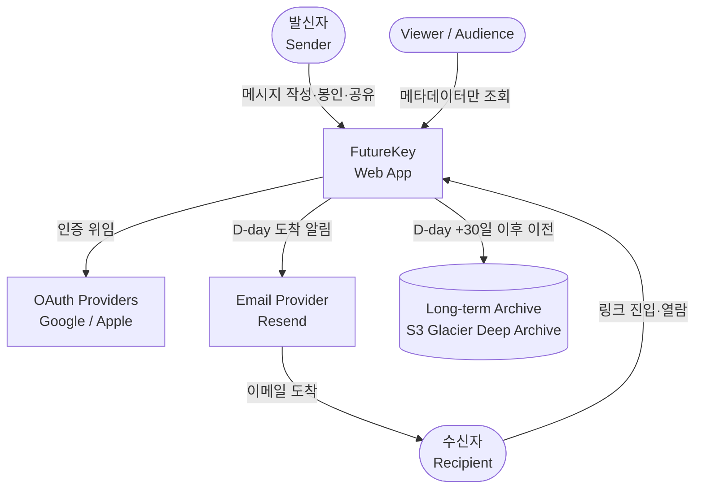

**액터 (Actors):**
- **발신자**: 미래 메시지를 작성·봉인·공유하는 사용자.
- **수신자**: 링크 또는 이메일을 통해 진입하여 D-day 이후 본문을 열람.
- **Viewer / Audience**: 본문은 볼 수 없으나 발신자가 허용한 메타데이터(존재, 공개일)만 조회.

---

## 4. 컨테이너 아키텍처 (Container View)

호스팅 모델은 **하이브리드**: 프론트엔드(Next.js)는 자체 VPS, 백엔드(Auth/DB/Storage/Workers)는 Supabase Cloud.

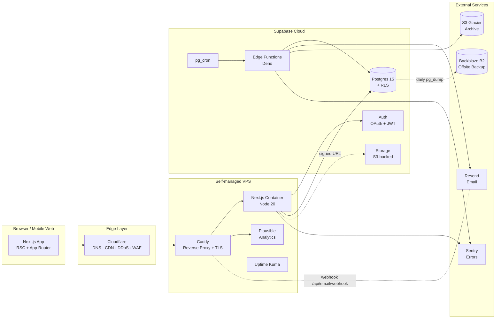

**컨테이너 책임:**

| 컨테이너 | 위치 | 책임 |
|---|---|---|
| Cloudflare | Edge | DNS, CDN, DDoS 보호, WAF, 봇 차단 |
| Caddy | VPS | TLS 자동(Let's Encrypt), HTTP→HTTPS, 리버스 프록시 |
| Next.js | VPS (Docker) | RSC 렌더, 인증 세션, RLS 컨텍스트 데이터 패칭, Resend webhook 수신 |
| Plausible | VPS (Docker) | 1st-party 분석 (Vercel Analytics 대체) |
| Uptime Kuma | VPS (Docker) | 자체 헬스체크 모니터링 |
| Supabase Auth | Cloud | OAuth 흐름, JWT 발급/검증 |
| Postgres + RLS | Cloud | 메시지/링크/스케줄 저장, RLS 권한 제어 |
| Storage | Cloud | 미디어 직접 업로드(Signed URL), 핫 스토리지 |
| Edge Functions | Cloud | D-day/리마인더/디스패처/아카이브 워커 |
| pg_cron | Cloud | 1분 단위 워커 트리거 |
| Resend | External | 이메일 발송 + 바운스/컴플레인 webhook |
| S3 Glacier | External | D-day +30일 이후 장기 보관 |
| Backblaze B2 | External | Supabase Cloud 외 별도 오프사이트 백업 (DR) |
| Sentry | External | 프론트 + Edge Function 에러 트래킹 |

---

## 5. 모노레포 구조 (Repo Layout)

레퍼런스 프로젝트(`erg-coach`, `bible-app`)와 동일한 패턴.

```
new-idea/
├─ apps/
│  └─ web/                     # Next.js 15 App Router 앱
├─ packages/
│  ├─ db/                      # Supabase 클라이언트, 타입, 쿼리 헬퍼
│  ├─ ui/                      # 공용 UI 컴포넌트
│  ├─ types/                   # 도메인 타입
│  └─ config/                  # eslint, tsconfig, tailwind preset
├─ supabase/
│  ├─ migrations/              # SQL 마이그레이션
│  ├─ functions/               # Edge Functions (Deno)
│  └─ seed.sql
├─ deploy/
│  ├─ docker-compose.yml       # VPS Production stack
│  ├─ Caddyfile                # Reverse proxy 설정
│  └─ scripts/                 # 배포·백업·복구 스크립트
├─ e2e/                        # Playwright e2e 테스트
├─ docs/                       # BRD, PRD, TRD, HLD …
├─ pnpm-workspace.yaml
└─ turbo.json
```

---

## 6. 컴포넌트 분해 (Component Breakdown)

### 6.1 Frontend Components (`apps/web`)

```mermaid
graph TD
    subgraph App[Next.js App Router]
        Layout[Root Layout<br/>+ Theme + Auth Provider]

        subgraph Public[Public Routes]
            Landing[/&nbsp;&nbsp;<br/>랜딩]
            MsgPage[/m/&#91;id&#93;<br/>수신자 진입]
            Privacy[/privacy<br/>개인정보 처리방침]
            Terms[/terms<br/>이용약관]
            Err[404 / 500 Error Pages]
        end

        subgraph Auth[Auth Routes]
            SignIn[/auth/signin]
            Callback[/auth/callback]
        end

        subgraph Protected[Protected Routes]
            Compose[/compose<br/>작성·봉인]
            Dashboard[/dashboard<br/>발신자 카운트다운]
            Settings[/settings<br/>프로필·알림·계정]
        end

        subgraph API[API Routes]
            EmailHook[/api/email/webhook<br/>Resend bounce]
            UnsubHook[/api/unsubscribe<br/>opt-out]
            Export[/api/me/export<br/>데이터 내보내기]
            Delete[/api/me/delete<br/>계정 삭제]
        end

        subgraph Shared[Shared Components]
            Countdown[Countdown UI<br/>server-time]
            MsgCard[Message Card]
            ShareSheet[Share Link Sheet]
            CookieBanner[Cookie Consent Banner]
        end
    end

    Layout --> Public
    Layout --> Auth
    Layout --> Protected
    Layout --> API
    Compose --> ShareSheet
    Dashboard --> MsgCard
    MsgPage --> Countdown
    Layout --> CookieBanner
```

### 6.2 Backend Components (`supabase/functions`)

| Function | 트리거 | 책임 |
|---|---|---|
| `dday-worker` | pg_cron 1분 | `available_at <= now()` 조건의 SEALED/LOCKED 메시지를 AVAILABLE로 일괄 전이 + 알림 큐 INSERT |
| `notification-dispatcher` | pg_cron 30초 | `notifications.status='pending'` 조회 → BlockList 검사 → Resend 발송 → 재시도 또는 DLQ 이동 |
| `archive-worker` | pg_cron 1일 1회 | D-day +30일 경과 미디어를 Supabase Storage → S3 Glacier 이전 |
| `seal-message` | HTTP (Next.js 호출) | 트랜잭션 내에서 DRAFT → SEALED 전이 + access_link 생성 |
| `account-deletion-worker` | pg_cron 1일 1회 | `users.deletion_requested_at` 30일 경과 시 익명화 처리 (PIPA right to erasure) |
| `audit-log` | DB Trigger | 민감 액션(봉인, 조회, 삭제)에 대한 감사 로그 기록 |

---

## 7. 핵심 사용자 여정 (Key Journeys)

### 시나리오 A — 메시지 작성 및 봉인

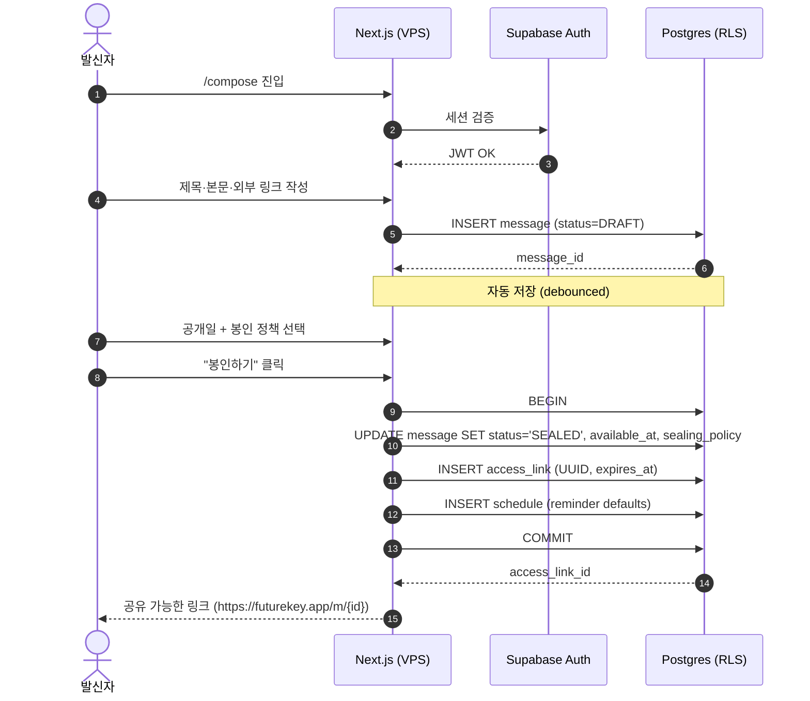

### 시나리오 B — 수신자 진입 (D-day 이전)

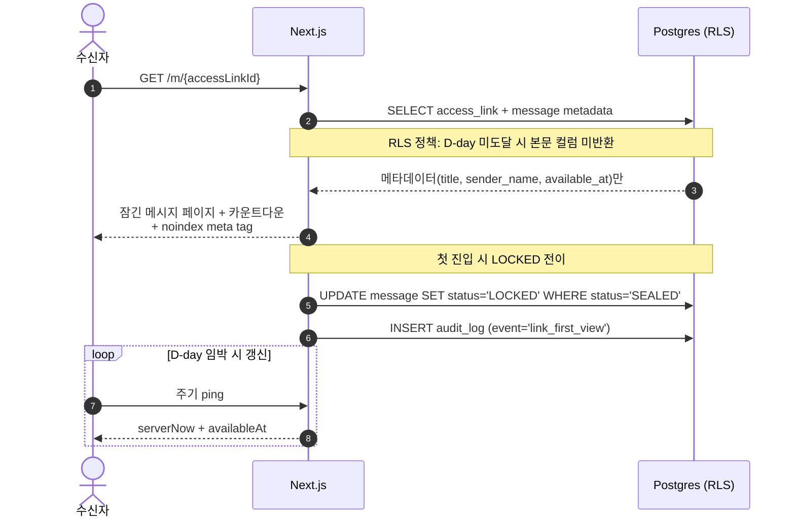

### 시나리오 C — D-day 도달 및 메시지 도착

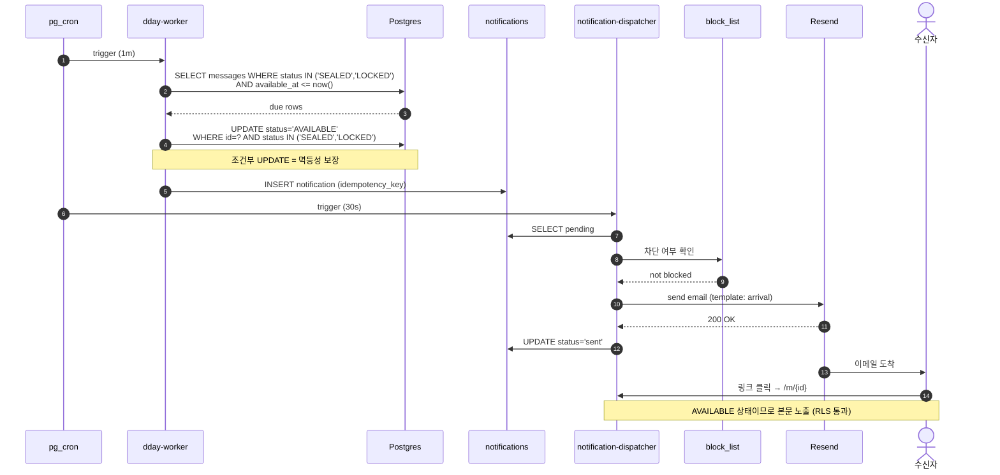

### 시나리오 D — 발송 실패 및 재시도

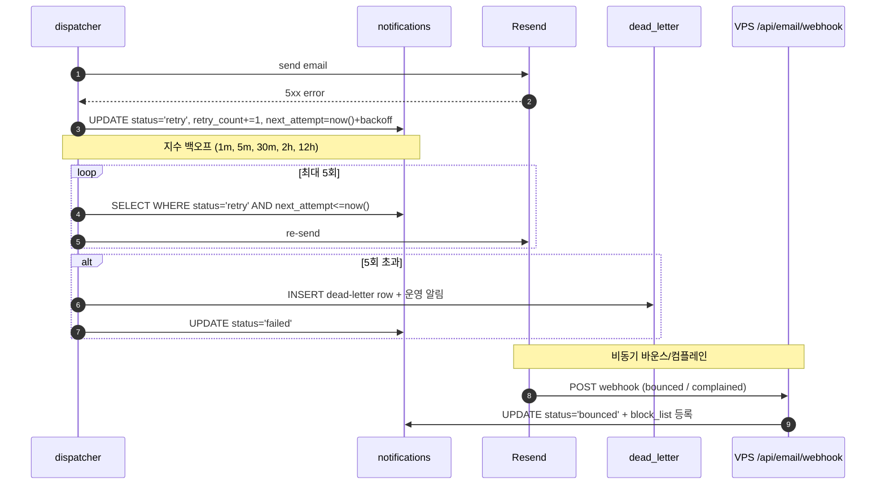

### 시나리오 E — 계정 삭제 (PIPA 정보주체 권리)

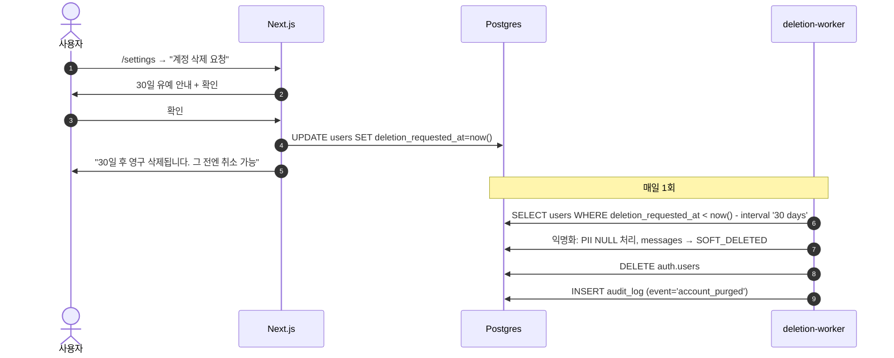

### 시나리오 F — 데이터 내보내기 (PIPA 정보 이동권)

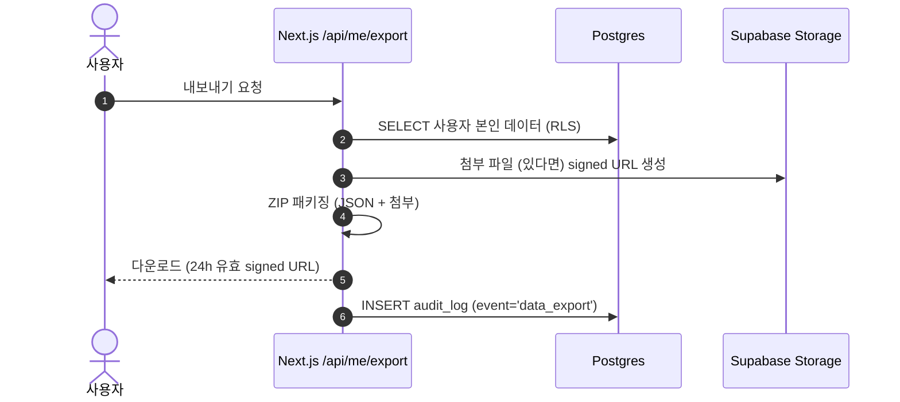

---

## 8. 데이터 모델 (Domain ERD)

```mermaid
erDiagram
    USERS ||--|| PROFILES : has
    USERS ||--o{ MESSAGES : creates
    MESSAGES ||--o{ MEDIA_ATTACHMENTS : contains
    MESSAGES ||--o{ ACCESS_LINKS : generates
    MESSAGES ||--|| SCHEDULES : has
    MESSAGES ||--o{ NOTIFICATIONS : produces
    MESSAGES ||--o{ AUDIT_LOGS : audited_by
    USERS ||--o{ BLOCK_LIST : maintains
    USERS ||--o{ REPORTS : files

    USERS {
        uuid id PK
        string oauth_provider
        string plan
        timestamp created_at
        timestamp deletion_requested_at
    }
    PROFILES {
        uuid user_id PK_FK
        string display_name
        string locale
        json notification_prefs
        bool marketing_opt_in
        timestamp marketing_consent_at
    }
    MESSAGES {
        uuid id PK
        uuid sender_id FK
        string title
        text body_encrypted
        string external_video_url
        timestamp available_at
        string sender_timezone
        string sealing_policy
        string status
        timestamp created_at
    }
    MEDIA_ATTACHMENTS {
        uuid id PK
        uuid message_id FK
        string storage_key
        string media_type
        bigint size_bytes
    }
    ACCESS_LINKS {
        uuid id PK
        uuid message_id FK
        string target_email
        timestamp expires_at
        bool used
    }
    SCHEDULES {
        uuid message_id PK_FK
        bool reminder_30d
        bool reminder_7d
        bool reminder_1d
    }
    NOTIFICATIONS {
        uuid id PK
        uuid message_id FK
        string type
        string status
        int retry_count
        string idempotency_key
        timestamp next_attempt
    }
    AUDIT_LOGS {
        uuid id PK
        uuid actor_id FK
        uuid message_id FK
        string event
        json metadata
        timestamp created_at
    }
    BLOCK_LIST {
        uuid id PK
        uuid user_id FK
        string scope
        uuid target_id
    }
    REPORTS {
        uuid id PK
        uuid reporter_id FK
        uuid message_id FK
        string reason
        string status
    }
```

---

## 9. 메시지 상태 머신 (State Machine)

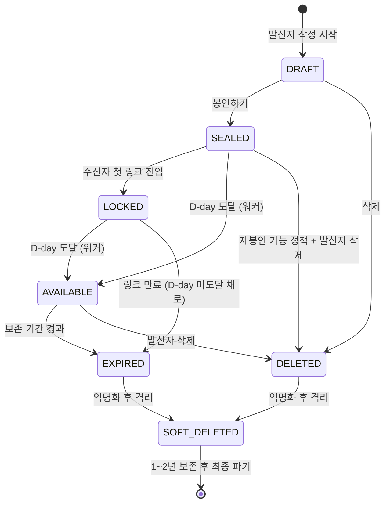

**불변 조건 (Invariants):**
- 모든 상태 전이는 단일 트랜잭션 + 조건부 UPDATE(`WHERE status = '<expected>'`)로만 가능 — 동시성 충돌 시 0 row 영향으로 안전 실패.
- `AVAILABLE` 진입 이전에는 어떤 경로로도 본문 컬럼 SELECT 불가 (RLS 강제).
- `DELETED` 상태는 발신자만 본 적이 있는 데이터 — 외부에 노출된 적 있는 메시지는 `EXPIRED`를 거쳐 `SOFT_DELETED`로 간다.

---

## 10. 횡단 관심사 (Cross-cutting Concerns)

### 10.1 인증 / 권한
- **Supabase Auth + RLS**: 모든 권한 검증은 DB 레이어 RLS에서 강제. 애플리케이션 레이어는 RLS를 우회할 수 없음.
- **수신자 OAuth 정책**: 본 HLD는 **하이브리드 모델**을 가정 — 링크 단독 진입 가능, 단 발신자가 "수신자 인증 필수" 옵션을 켠 메시지는 OAuth 강제. PRD §14.5 Q6 종결 필요.

### 10.2 시간 처리
- 모든 `*_at` 컬럼은 UTC `timestamptz` 저장.
- 발신자 입력은 `messages.sender_timezone`에 보관, 표시 시 수신자 TZ로 변환.
- D-day 판정은 **서버**에서만, `now() AT TIME ZONE 'UTC'` 기준.

### 10.3 관측성 (Observability)
- **Sentry** (External): 프론트엔드 + Edge Function 에러.
- **Plausible** (VPS, self-host): 1st-party 분석 (cookie-less, GDPR/PIPA 친화).
- **Uptime Kuma** (VPS): 자체 헬스체크 / 외부 의존성 ping.
- **Supabase Logs**: DB 쿼리, RLS 거부, Edge Function 로그.
- **운영 대시보드 (Post-MVP)**: 발송 성공률, D-day 지연, DLQ 누적량 → Grafana + Postgres exporter 검토.

### 10.4 접근성 (Accessibility)
- WCAG 2.1 AA 목표 (PRD §11.4).
- 카운트다운은 색상 외에도 텍스트 레이블 병기.
- 키보드 단독 작성 → 봉인 → 공유 플로우 가능.

### 10.5 PIPA 컴플라이언스
- **개인정보 처리방침** (`/privacy`) 별도 페이지 노출.
- **이용약관** (`/terms`) 별도 페이지.
- **마케팅 알림 동의(opt-in)** — 가입 시 분리, `profiles.marketing_opt_in` 저장.
- **처리위탁 명시**: Supabase, Resend, Cloudflare, Sentry 등 처리위탁 사실 처리방침에 기재.
- **정보주체 권리**:
    - **열람·정정**: `/settings`에서 직접 수정.
    - **삭제 (right to erasure)**: §7 시나리오 E. 30일 유예 후 익명화.
    - **이동 (right to portability)**: §7 시나리오 F. JSON + ZIP 다운로드.
    - **처리정지**: 알림 옵트아웃 + 차단(BlockList).
- **국외 이전 고지**: Supabase Cloud, Sentry 등 서버가 국외에 위치한 경우 처리방침에 명시 + 별도 동의 검토.

### 10.6 Rate Limiting & Abuse
- Cloudflare 단계: WAF + 봇 차단 + 기본 rate limit (무료 tier).
- VPS 단계: Caddy 또는 Next.js middleware에서 IP 단위 rate limit (예: `/m/*` 분당 60회, `/auth/*` 분당 10회).
- 차단된 발신자는 신규 메시지 생성 제한.

### 10.7 i18n (다국어)
- **MVP**: 한국어 단일.
- **준비 작업만**: `next-intl` 도입, `apps/web/messages/{ko,en}.json` 구조 마련, 모든 사용자 노출 문자열을 catalog 키로 분리.
- **확장 시점**: 베타 이후 영어 추가. 도메인은 기본 단일 (`/ko`, `/en` path-based).

### 10.8 OG / 공유 메타데이터
- `/m/{id}` 페이지는 **dynamic OG image** 제공 (Next.js `opengraph-image.tsx`).
    - 잠긴 상태: "잠긴 메시지 — D-30 일 남음" 류 일러스트 + 발신자명 (있다면).
    - 본문은 절대 OG에 포함하지 않음.
- 모든 `/m/{id}` 페이지는 `<meta name="robots" content="noindex,nofollow">` (검색엔진 노출 차단).
- `og:title`, `og:description`, `twitter:card` 표준 셋업.

### 10.9 에러 페이지
- `app/not-found.tsx` (404): 따뜻한 톤, 홈으로 돌아가기 + 검색.
- `app/error.tsx` (500): "잠시 후 다시 시도" + Sentry trace ID.
- `app/(maintenance)/maintenance.tsx`: 점검 모드 (env flag로 활성화).
- 만료된 링크 (`/m/{id}` 만료 상태): 별도 안내 페이지, 메시지 정보 미노출 (PRD §9.5).

### 10.10 성능 예산 (Performance Budgets)
| 페이지 | LCP | TTI | JS bundle | 비고 |
|---|---|---|---|---|
| `/` 랜딩 | < 1.5s | < 2.0s | < 150KB | 첫인상 핵심 |
| `/m/{id}` 잠금 | < 1.0s | < 1.5s | < 100KB | 바이럴 대량 진입 가능 |
| `/compose` | < 2.0s | < 2.5s | < 250KB | 인증 후, 부담 적음 |
| `/dashboard` | < 2.0s | < 2.5s | < 250KB | |

- 각 PR에서 Lighthouse CI 또는 `@next/bundle-analyzer`로 회귀 감지.

### 10.11 시크릿 관리
- **Local**: `.env.local` (gitignore).
- **Production VPS**: `/etc/futurekey/.env` (mode 600, deploy user only).
- **CI**: GitHub Actions Secrets.
- **Supabase Cloud**: Project Settings → Vault.
- **순환 정책**: 분기 1회 OAuth 시크릿, Resend API 키 갱신 검토.
- **금지**: 시크릿을 Docker 이미지에 빌드 타임으로 포함하지 않음. 런타임 주입.

### 10.12 쿠키 / 동의
- **필수 쿠키만 기본 사용**: Supabase Auth 세션 쿠키.
- **분석/마케팅 쿠키 미사용** (Plausible은 cookie-less).
- 그래도 PIPA 권고에 따라 첫 방문 시 **Cookie Consent Banner** 노출 — 분석 활성/비활성 토글.

---

## 11. 환경 및 배포 (Environments & Deployment)

### 11.1 환경 분리

```mermaid
graph TD
    Dev[Developer Local]

    subgraph LocalEnv[Local]
        L1[Supabase CLI<br/>local Postgres]
        L2[Next.js dev]
    end

    subgraph PreviewEnv[PR Preview]
        P1[Preview VPS subdomain<br/>preview-{pr}.futurekey.app]
        P2[Supabase Branch DB]
    end

    subgraph ProdEnv[Production]
        Pr1[Production VPS<br/>futurekey.app]
        Pr2[Supabase Prod Project]
        Pr3[Resend Prod]
    end

    Dev --> LocalEnv
    Dev -->|git push| GH[GitHub]
    GH -->|PR open| PreviewEnv
    GH -->|merge to main| ProdEnv

    GHA[GitHub Actions<br/>lint·typecheck·test·e2e·build] -.gating.- GH
```

### 11.2 VPS 배포 토폴로지

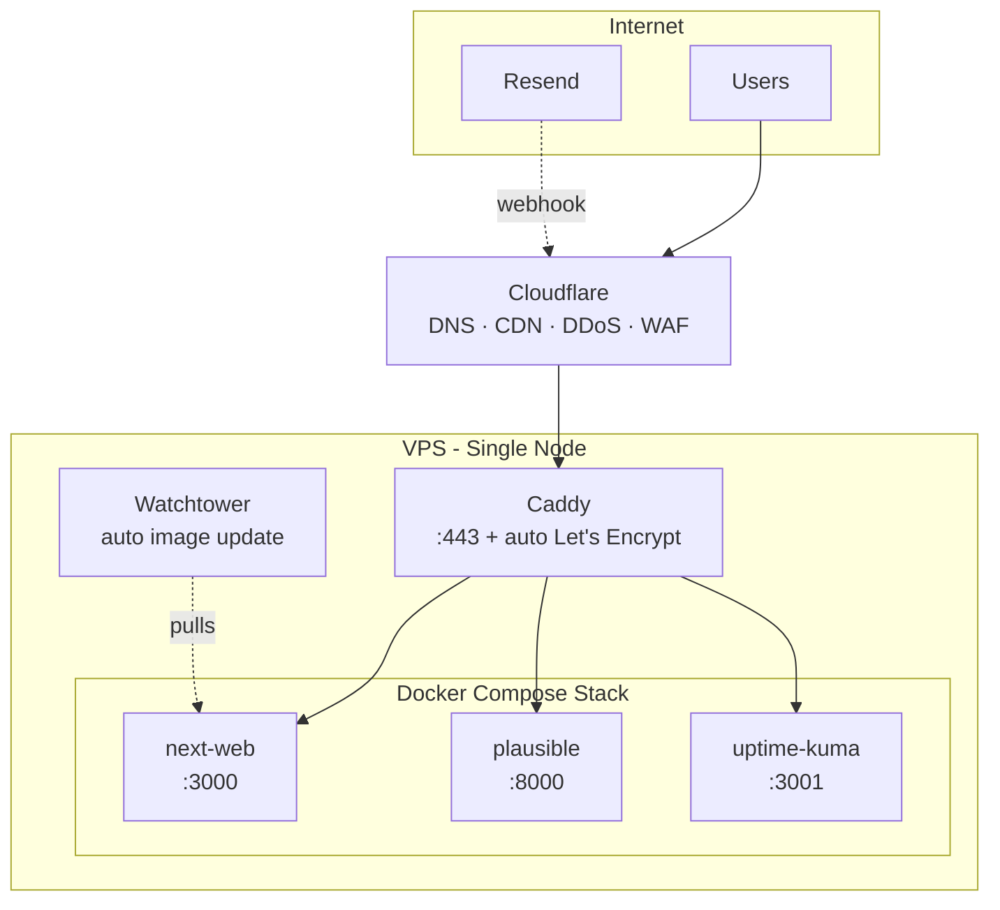

**`docker-compose.yml` 서비스 구성 (요약):**
```
services:
  caddy:        # 호스트 :80, :443 → 인증서 자동 갱신
  next-web:     # Node 20, 환경변수로 Supabase URL / 키 주입
  plausible:    # self-hosted analytics
  uptime-kuma:  # status monitoring
  watchtower:   # 이미지 자동 갱신 (선택)
```

**스케일링 경로**: MVP는 단일 VPS. 트래픽 증가 시 (1) VPS 수직 확장, (2) Next.js 컨테이너 다중 인스턴스 + Caddy 로드밸런싱, (3) Next.js만 별도 노드 분리.

### 11.3 도메인 / DNS / TLS / CDN
- **도메인**: `futurekey.app` (또는 확정 도메인)
- **DNS**: Cloudflare 관리, A 레코드 → VPS IPv4, AAAA → IPv6.
- **TLS**: Caddy 자동 발급 (Let's Encrypt). HSTS preload 등록 검토.
- **CDN/Edge**: Cloudflare Proxy 모드(주황 구름) 활성. 정적 자산은 Next.js standalone build의 `_next/static/*`을 Cloudflare가 자동 캐시.
- **이메일 도메인**: `mail.futurekey.app` 별도 서브도메인 + Resend DKIM / SPF / DMARC TXT 레코드 (Sprint 0 완료 필수 — 도달률 검증 시간 필요).

### 11.4 백업 및 재해 복구 (Backup & DR)
| 데이터 | 1차 보호 | 2차(오프사이트) | RPO | RTO |
|---|---|---|---|---|
| Postgres (Supabase Cloud) | Supabase 자동 일일 백업 7일 | Backblaze B2로 매일 `pg_dump` (Edge Function 또는 GitHub Action) | 24h | 4h |
| Storage (Supabase) | Supabase 내부 복제 | 주 1회 핵심 버킷 → S3 동기화 | 7d | 8h |
| 코드 / 인프라 | GitHub | GitHub forks + 로컬 클론 | — | — |
| VPS 디스크 | 호스팅사 스냅샷 (주 1회) | — | 7d | 4h |
- **복구 드릴**: 분기 1회, 백업 → 신규 Supabase Project 복원 → e2e 핵심 시나리오 검증.

### 11.5 CI/CD 흐름
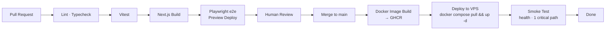

### 11.6 무중단 배포 (Zero-Downtime)
- **MVP 단계**: Caddy 단일 백엔드 + `docker compose up -d --no-deps next-web` → 순간 단절(<1s) 허용.
- **베타 이후**: 2개 컨테이너(`next-web-blue`, `next-web-green`) + Caddy upstream 스왑으로 진정한 zero-downtime.

### 11.7 VPS 하드닝 체크리스트
- [ ] Root 로그인 비활성화, SSH 키만 허용 (`PasswordAuthentication no`)
- [ ] SSH 포트 변경 (선택) + `fail2ban`
- [ ] UFW: 22(또는 변경), 80, 443만 허용
- [ ] `unattended-upgrades` 활성화 (보안 패치 자동)
- [ ] Non-root 배포 사용자 (`deploy`) — Docker 그룹 가입
- [ ] Docker daemon 외부 노출 금지
- [ ] `.env` 파일 권한 600
- [ ] 정기 OS 업데이트 일정
- [ ] Cloudflare-only ingress: VPS 방화벽에서 Cloudflare IP 대역만 허용 (선택, 강력)

---

## 12. 테스트 전략 (Testing Strategy)

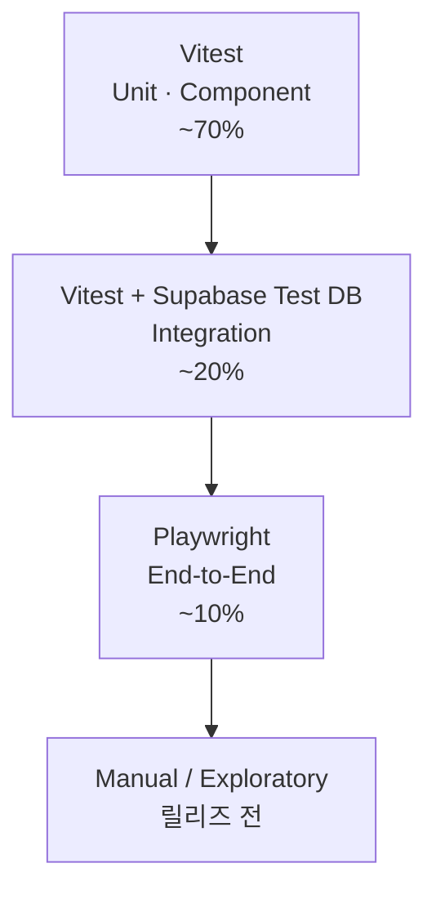

| 레벨 | 도구 | 범위 | 실행 시점 |
|---|---|---|---|
| Unit | Vitest | 순수 함수, 컴포넌트 렌더, 유틸 | PR마다 |
| Integration | Vitest + Supabase 로컬 DB | RLS 정책, 상태 전이, 워커 로직 | PR마다 |
| E2E | Playwright | 작성→봉인→공유→D-day→열람 골든 패스 | PR Preview |
| 부하 | k6 (선택) | 카운트다운 페이지 동시접속 10K | Sprint 6 |
| 회귀 | Playwright + Visual snapshot | 핵심 페이지 시각 변화 | 릴리즈 전 |

**RLS 정책 테스트는 필수**: 발신자/수신자/타인 시나리오에서 각 테이블 SELECT/INSERT/UPDATE 결과를 명시적으로 검증.

---

## 13. 스프린트 계획 (Sprint Plan)

MVP를 **6개 스프린트(약 12주)** 로 분할. 각 스프린트의 결과물은 데모 가능한 사용자 가치를 가진다.

### Sprint 0 — Foundation (1.5주)
**목표:** 모든 후속 작업이 의존하는 기반 구축. **VPS + 도메인 + 이메일 발송 부트스트랩 포함.**

| Epic | 작업 |
|---|---|
| Repo / Build | pnpm + Turborepo 셋업 (`apps/web`, `packages/{db,ui,types,config}`) |
| Supabase 프로비저닝 | Dev / Prod 프로젝트 생성, CLI 연결, 초기 마이그레이션 |
| Frontend Scaffold | Next.js 15 App Router + Tailwind + shadcn/ui base |
| **VPS 프로비저닝** | OS 셋업, SSH 키, UFW, fail2ban, deploy 사용자 |
| **도메인 / DNS** | Cloudflare 등록, A/AAAA, TLS via Caddy |
| **Docker Compose stack** | Caddy + Next.js + Plausible + Uptime Kuma |
| **이메일 도메인 부트스트랩** | Resend 계정, DKIM/SPF/DMARC 레코드, 도달률 PoC |
| CI/CD | GitHub Actions + GHCR 이미지 빌드 + VPS 배포 스크립트 |
| Observability | Sentry 통합, Plausible 통합 |
| Design System | 기본 토큰(컬러·타이포·간격), 1차 컴포넌트(Button, Input, Card) |

### Sprint 1 — Auth & Compose Draft (2주)
**목표:** 발신자가 로그인하고 메시지 초안을 작성·저장할 수 있다.

| Epic | 작업 |
|---|---|
| Auth | Supabase Auth Google/Apple Provider 활성화, `/auth/{signin,callback}` |
| Profile | 첫 로그인 시 `profiles` 자동 생성, `/settings` 프로필 편집 |
| Compose UI | `/compose` — 제목, 본문, 외부 영상 링크 입력 |
| Draft 저장 | DRAFT 상태로 자동 저장 (debounced) |
| DB | `users`, `profiles`, `messages` 테이블 + RLS 정책 |
| RLS Test | 통합 테스트로 RLS 정책 검증 |

**End-of-sprint demo:** 로그인 → 메시지 초안 작성 → 새로고침 후에도 초안이 보임.

### Sprint 2 — Seal & Schedule (2주)
**목표:** 발신자가 메시지를 봉인하고 공유 링크를 받는다.

| Epic | 작업 |
|---|---|
| Date Picker | TZ-aware 공개일 선택 (`sender_timezone` 저장) |
| Sealing Policy | 완전 잠금 / 재봉인 가능 토글 |
| Seal Action | DRAFT → SEALED 트랜잭션 (Edge Function `seal-message`) |
| Access Link | UUID 발급, expires_at 설정 |
| Share Sheet | 링크 복사·이메일·SNS 공유 UI |
| OG Image | 잠긴 메시지 dynamic OG 이미지 |
| DB | `access_links`, `schedules` 테이블 + RLS |

**End-of-sprint demo:** 메시지 봉인 → 공유 가능한 링크 출력 → 카카오톡 미리보기에 OG 이미지 표시.

### Sprint 3 — Recipient Locked & Countdown (2주)
**목표:** 수신자가 잠긴 메시지를 보고, D-day 도달 시 본문이 자동 노출된다.

| Epic | 작업 |
|---|---|
| Locked Page | `/m/{id}` — 잠금 메타데이터 + 카운트다운 + `noindex` |
| Countdown UI | 서버 시간 기준, 클라이언트 시계 미신뢰 |
| LOCKED 전이 | 첫 진입 시 SEALED → LOCKED |
| D-day Worker | pg_cron + Edge Function `dday-worker` (LOCKED/SEALED → AVAILABLE) |
| AVAILABLE View | 수신자 본문 표시 페이지 |
| Audit Log | `audit_logs` 테이블 + DB Trigger |
| 에러 페이지 | 404 / 500 / 만료 페이지 |

**End-of-sprint demo:** 1분 뒤 공개되도록 봉인 → 카운트다운 → 자동 잠금 해제 → 본문 노출. 전체 골든 패스 완성.

### Sprint 4 — Email Notifications (1.5주)
**목표:** D-day 도달 시 수신자가 자동으로 이메일을 받는다.

| Epic | 작업 |
|---|---|
| Resend 통합 | 코드 통합 (Sprint 0에서 도메인은 부트스트랩 완료) |
| Email Templates | 도착 알림 (한국어 1차) — 반응형 HTML |
| Dispatcher | Edge Function `notification-dispatcher` + 큐 폴링 |
| Retry / DLQ | 지수 백오프, 5회 초과 시 dead_letter 이동 |
| Idempotency | `idempotency_key` UNIQUE 제약 |
| Webhook 수신 | VPS `/api/email/webhook` — bounce/complaint 처리 |
| DB | `notifications`, `dead_letter_notifications` 테이블 |

**End-of-sprint demo:** D-day 도달 → 수신자 메일함에 알림 도착 → 메일 내 링크 클릭 → 본문 표시. 바운스 시 자동 BlockList 등록.

### Sprint 5 — Trust & Safety (1.5주)
**목표:** 수신 거부, 차단, 신고 등 남용 방지 기본 기능.

| Epic | 작업 |
|---|---|
| Opt-out | 이메일 footer "수신 거부" 링크 → `/api/unsubscribe` 엔드포인트 |
| Block List | `block_list` 테이블 + dispatcher 발송 직전 검사 |
| Reports | `reports` 테이블 + `/m/{id}` 신고 버튼 |
| Rate Limit | Caddy + Next.js middleware IP rate limit |
| Admin View | 운영자가 신고 큐 조회 (Supabase Studio로 충당) |
| 계정 삭제 / 데이터 내보내기 | `/api/me/{delete,export}` 엔드포인트 + 30일 유예 워커 |

**End-of-sprint demo:** 수신 거부 토글 후 D-day 도달 → 알림 발송 안 됨. 계정 삭제 요청 → 30일 카운트다운.

### Sprint 6 — Polish & Beta Launch (2주)
**목표:** 첫 베타 사용자에게 공개 가능한 품질로 다듬는다.

| Epic | 작업 |
|---|---|
| Onboarding | 3단계 온보딩 (남기기·잠그기·열리는 날 받기) |
| Templates | 5~6종 메시지 템플릿 (생일·기념일·미래의 나에게 등) |
| Accessibility | WCAG 2.1 AA 패스, 키보드 플로우 검증 |
| Mobile QA | 주요 디바이스 매트릭스 검증 |
| Legal | 개인정보 처리방침, 이용약관, PIPA 동의 플로우, 쿠키 배너 |
| Performance | Lighthouse CI 통과, 성능 예산 위반 점검 |
| i18n 준비 | `next-intl` 도입, 모든 문자열 catalog 분리 (한국어만) |
| Activation Funnel | Plausible 이벤트 (가입 → 첫 메시지 생성 → 봉인) |
| Launch Checklist | 도메인, OG 메타, 이메일 도달률 재검증, DR 백업 검증, 부하 테스트 |

**End-of-sprint demo:** 신규 사용자 시나리오를 처음부터 끝까지 완주, PIPA 동의 포함, 베타 사용자 초대 가능.

---

## 14. 의존성 및 위험 (Dependencies & Risks)

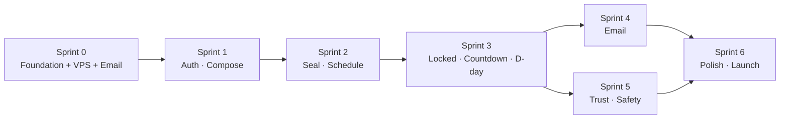

**주요 위험:**
- **이메일 도달률**: 한국 이메일(네이버, 다음) 도달률은 Sprint 0에서 PoC 필수 — 늦게 발견 시 출시 지연.
- **카운트다운 정확성**: 서버-클라이언트 시간 동기화 버그는 신뢰 훼손과 직결 — Sprint 3 종료 전 시간대 회귀 테스트.
- **PIPA 컴플라이언스**: Sprint 5/6에 몰면 출시 지연 위험 — 법무 검토는 Sprint 4와 병행.
- **VPS 단일 장애점 (SPOF)**: MVP 수용 가능, 베타 이후 다중 노드 검토.
- **Cloudflare 의존**: DNS, CDN, DDoS 모두 단일 벤더 — 장애 시 영향. (대안: Bunny CDN + 별도 DNS)
- **Supabase Cloud 의존 + 국외 이전**: 한국 사용자 데이터 국외 이전 동의 절차 필요. 자체 호스팅 옵션은 Post-MVP에서 재검토.
- **Resend 한국 도달률**: Sprint 0 PoC 결과에 따라 SES 또는 국내 SMTP 백업 옵션 필요할 수 있음.

---

## 15. 측정 지표 (Success Metrics — MVP)

PRD §13에서 발췌, MVP 단계에서 측정 가능한 항목:

| 카테고리 | 지표 | 타겟 (베타 8주차) |
|---|---|---|
| Activation | 가입 후 첫 메시지 생성율 | ≥ 40% |
| Activation | 첫 메시지 생성까지 시간 | < 5분 (중앙값) |
| 핵심 | 봉인 완료율 (작성 → 봉인) | ≥ 60% |
| 신뢰 | D-day 도달 후 알림 발송 성공률 | ≥ 99% |
| 신뢰 | D-day 도달 후 열람 완료율 | ≥ 50% |
| 성장 | 수신자 → 가입자 전환율 | ≥ 15% |
| 운영 | VPS 가동률 (Uptime) | ≥ 99.5% |
| 운영 | p95 페이지 응답 시간 | < 800ms |

---

## 16. 오픈 이슈 (Open Issues — HLD 시점)

PRD §14.5 및 TRD §8.1에서 이어지는 항목 중 HLD 단계에 영향을 주는 것:

1. **수신자 OAuth 정책** (PRD Q6 / TRD §8.1) — HLD는 하이브리드 가정. Sprint 2 종료 전 PRD 확정 필요.
2. **메시지 본문 컬럼 암호화** — `pgcrypto` 적용 시 검색·인덱싱 영향. Sprint 1 DB 모델링 시 결정.
3. **리마인더 (P2)** — MVP 범위 밖이지만 `schedules` 테이블 스키마는 미리 마련.
4. **카카오 OAuth** — Post-MVP 검토.
5. **Storage 아카이브 워커** — Sprint 6 또는 베타 이후로 이동 가능 여부.
6. **국외 이전 동의 UX** — Supabase Cloud, Sentry 사용 명시 + 가입 시 동의 흐름.
7. **VPS 사양** — 메모리/CPU/디스크 결정 (예상 동시접속 10K 흡수 가능 사이즈).

---

## 17. 다음 단계 (Next Steps)

1. **본 HLD 리뷰** — 엔지니어링 + 디자인 + 프로덕트 합의.
2. **PRD §14.5 Q6 종결** — 수신자 OAuth 정책 결정.
3. **VPS 사양 확정** — 호스팅사·리전·인스턴스 사이즈.
4. **도메인 확정** — `futurekey.app` 또는 대체 도메인.
5. **Sprint 0 킥오프** — 모노레포 + VPS + 이메일 도메인 동시 셋업 PR.
6. **티켓 분해** — 각 Epic을 GitHub Issue / Linear 티켓으로 변환.
7. **디자인 와이어프레임** — Sprint 1 시작 전 `/compose`, `/m/{id}` 와이어프레임 확정.
