# FutureKey – 전체 사용자 여정 (User Journey)

**문서 버전:** Draft v0.1
**작성일:** 2026-05-04
**대상:** 제품 / 디자인 / 개발팀

---

## 여정 다이어그램

> **점수 기준:** ★ = 감정적 만족 또는 기대감 &nbsp;|&nbsp; ☆ = 마찰 또는 저항감 &nbsp;(1–5점)
>
> **액터 색상:** 🔵 발신자 &nbsp;|&nbsp; 🟢 수신자 &nbsp;|&nbsp; 🟠 Viewer(공개 관람자) &nbsp;|&nbsp; 🟣 시스템

```mermaid
flowchart TD
    classDef sender    fill:#3B82F6,color:#fff,stroke:#1D4ED8,stroke-width:1.5px
    classDef recipient fill:#10B981,color:#fff,stroke:#047857,stroke-width:1.5px
    classDef viewer    fill:#F59E0B,color:#1a1a1a,stroke:#B45309,stroke-width:1.5px
    classDef system    fill:#8B5CF6,color:#fff,stroke:#6D28D9,stroke-width:1.5px

    subgraph OB["🚪 온보딩"]
        direction TB
        S1["랜딩 페이지 방문 ★4"]:::sender
        S2["3단계 온보딩 안내 확인 ★3"]:::sender
        S3["OAuth 로그인 (Google / Apple) ★3"]:::sender
        S1 --> S2 --> S3
    end

    subgraph MC["✍️ 메시지 작성 · 발신자"]
        direction TB
        S4["새 미래 메시지 만들기 ★5"]:::sender
        S5["메시지 유형 선택 (텍스트 / 영상 링크) ★4"]:::sender
        S6["카테고리 템플릿 선택 ★4"]:::sender
        S7["제목과 본문 작성 ★4"]:::sender
        S8["외부 영상 링크 등록 (선택) ★3"]:::sender
        S9["수신자 이메일 입력 ★3"]:::sender
        S10["공개일 및 시간대 설정 ★5"]:::sender
        S11["공개 범위 선택 ★4"]:::sender
        S12["공개 전 존재 알림 여부 설정 ★4"]:::sender
        S13["봉인된 메시지 카드 미리보기 ★5"]:::sender
        S14["🔐 봉인하기 확인 ★5"]:::sender
        S4 --> S5 --> S6 --> S7 --> S8 --> S9 --> S10 --> S11 --> S12 --> S13 --> S14
    end

    subgraph SH["🔗 공유 · 발신자"]
        direction TB
        S15["시스템이 고유 접근 링크 생성 ★5"]:::sender
        S16["링크 복사 또는 이메일 전송 ★4"]:::sender
        S17["공개 존재 페이지 공유 (선택) ★3"]:::sender
        S15 --> S16 --> S17
    end

    subgraph PR_R["🔒 공개일 이전 · 수신자"]
        direction TB
        R1["존재 알림 이메일 수신 ★4"]:::recipient
        R2["링크 클릭 → 잠긴 메시지 페이지 도착 ★4"]:::recipient
        R3["OAuth 로그인 ★2"]:::recipient
        R4["권한 및 링크 유효성 검증 ★3"]:::recipient
        R5["잠김 상태 확인 — 본문 비공개 ★3"]:::recipient
        R6["공개 예정일 및 D-day 카운트다운 확인 ★4"]:::recipient
        R7["공개일 알림 수신 설정 ★4"]:::recipient
        R8["발신자 차단 또는 수신 거부 ☆1"]:::recipient
        R1 --> R2 --> R3 --> R4 --> R5 --> R6 --> R7
        R5 -.->|"원치 않는 메시지"| R8
    end

    subgraph PR_V["👁️ 공개일 이전 · Viewer"]
        direction TB
        V1["공개 존재 페이지 URL 방문 ★3"]:::viewer
        V2["메시지 존재 및 공개 예정일 확인 ★3"]:::viewer
        V3["D-day 카운트다운 관람 ★4"]:::viewer
        V4["본문·개인정보는 비공개 상태 유지 ★2"]:::viewer
        V1 --> V2 --> V3 --> V4
    end

    subgraph RD_SYS["⚙️ 공개일 당일 · 시스템"]
        direction TB
        SYS1["dday-worker가 available_at 도달 감지 ★5"]:::system
        SYS2["메시지 상태 → AVAILABLE 전이 ★5"]:::system
        SYS3["수신자에게 공개 알림 이메일 발송 ★4"]:::system
        SYS1 --> SYS2 --> SYS3
    end

    subgraph RD_R["🔓 공개일 당일 · 수신자"]
        direction TB
        R9["공개 알림 이메일 열기 ★5"]:::recipient
        R10["이메일 내 접근 링크 클릭 ★5"]:::recipient
        R11["OAuth 로그인 ★3"]:::recipient
        R12["서버 검증: 키 + 계정 + 공개일 확인 ★4"]:::recipient
        R13["✨ 모든 조건 충족 → 메시지 공개 ★5"]:::recipient
        R14["텍스트 읽기 또는 영상 링크 열람 ★5"]:::recipient
        R15["콘텐츠 다운로드 / 내보내기 (유료 전용) ★3"]:::recipient
        R9 --> R10 --> R11 --> R12 --> R13 --> R14 --> R15
    end

    OB       --> MC
    MC       --> SH
    SH       -->|"링크 / 이메일 발송"| PR_R
    SH       -->|"공개 페이지 게시"| PR_V
    PR_R     --> RD_SYS
    PR_V     -.->|"공개일까지 대기"| RD_SYS
    RD_SYS   --> RD_R
```

---

## 메시지 상태 참조

| 상태 | 의미 |
|---|---|
| `DRAFT` | 작성 중. 발신자만 접근 가능 |
| `SEALED` | 발신자가 확정. 예약 스케줄에 등록됨 |
| `LOCKED` | 링크가 공유되었으나 공개일 이전 — 메타데이터만 노출 |
| `AVAILABLE` | 공개일 도달. 권한 있는 수신자가 본문 열람 가능 |
| `EXPIRED` | 접근 링크 또는 보존 기간이 만료됨 |
| `DELETED` | 발신자에 의해 UI에서 삭제됨 |
| `SOFT_DELETED` | 익명화 처리 후 정책 기간 동안 내부 보존 |

---

## 주요 UX 설계 포인트

### 1. 봉인 액션 *(발신자 — 메시지 작성 섹션)*

"봉인하기" 버튼은 발신자 여정의 **감정적 클라이맥스**다. 초안이 약속으로 바뀌는 순간이므로, 일반 저장 버튼처럼 처리하면 제품의 핵심 감성을 낭비하게 된다. 봉인 직후 화면은 "당신의 메시지가 [날짜]까지 잠겼습니다"를 명확히 전달해야 한다.

**설계 집중 포인트:** 봉인 전환 애니메이션, 봉인 완료 확인 화면, 잠긴 카드 미리보기

---

### 2. 수신자의 첫 도착: 잠긴 메시지 페이지 *(수신자 — 공개일 이전)*

수신자는 아무런 사전 정보 없이 도착해, 볼 수 없는 콘텐츠를 마주하고, 로그인을 요구받는다. **가장 높은 마찰이 가장 중요한 순간에 집중**된다. 로그인 유도 전에 "누군가 당신에게 메시지를 남겼습니다. [날짜]에 열립니다"라는 따뜻한 메시지로 먼저 기대감을 만들어야 한다. 이 화면에서의 이탈은 바이럴 확산을 직접 차단한다.

**설계 집중 포인트:** 잠긴 페이지 히어로 카피, 발신자 정보 노출 범위 정책, 로그인 게이트 위치

---

### 3. 수신자 OAuth 로그인 게이트 *(수신자 — 공개일 이전 & 공개일 당일)*

FutureKey를 처음 접하는 수신자에게 OAuth 로그인을 강제하면 이탈 위험이 크다. TRD §3.1.3에서 제안하는 **하이브리드 접근 모델** — 일반 메시지는 링크 단독 진입 허용, 민감 메시지는 OAuth 필수 — 을 UX로 구현하는 것이 수신자 활성화율의 핵심 레버다.

**설계 집중 포인트:** 익명 미리보기 허용 깊이, 로그인 유도 문구, 단계적 인증 흐름

---

### 4. 공개일 콘텐츠 공개 순간 *(수신자 — 공개일 당일)*

모든 기대감이 해소되는 순간이다. `LOCKED → AVAILABLE` 전환은 **무언가를 여는 느낌**이어야 하며, 단순 페이지 새로고침이 되어서는 안 된다. 콘텐츠가 드러나는 애니메이션, 발신자 이름이 나타나는 방식이 FutureKey를 예약 이메일과 차별화하는 핵심이다. 이 순간의 품질이 수신자의 입소문 여부를 직접 결정한다.

**설계 집중 포인트:** 공개 애니메이션, 첫 열람 시 콘텐츠 레이아웃, 공개 후 공유 유도 UI

---

### 5. 공개 존재 페이지 *(Viewer — 공개일 이전)*

공개 존재 페이지는 제품의 **주요 바이럴 접점**이다. 타인의 카운트다운을 목격한 Viewer는 자신도 메시지를 만들고 싶어진다. PRD §9.2의 "공개 전 개인정보 비노출" 원칙을 지키면서 발신자 전환 CTA를 자연스럽게 녹이는 것이 설계 과제다.

**설계 집중 포인트:** 카운트다운 애니메이션, "나도 만들기" CTA 문구 및 위치, 개인정보 비노출 메타데이터 표시

---

## 용어 정리

| 용어 | 설명 |
|---|---|
| 발신자 / 크리에이터 | 미래 메시지를 작성·봉인·공유하는 사용자 |
| 수신자 | 지정된 공개일에 메시지를 받아 열람하는 사용자 |
| Viewer / Audience | 본문은 볼 수 없고 메시지 존재와 공개 예정일만 확인 가능한 공개 관람자 |
| 봉인 | 메시지를 확정하여 예약·공유 가능한 상태로 만드는 행위 |
| 공개일 / D-day | 메시지 잠금이 해제되는 날짜와 시간 |
| 접근 링크 | 수신자 진입용 만료 가능한 고유 URL |
| 존재 공개 | 메시지 내용 없이 "메시지가 있다"는 사실만 공개하는 설정 |
