# FutureKey – End-to-End User Journey

**Document Version:** Draft v0.1
**Date:** 2026-05-04
**Prepared for:** Product / Design / Engineering

---

## Journey Diagram

> **Score:** ★ = emotional satisfaction / delight &nbsp;|&nbsp; ☆ = friction or reluctant action &nbsp;(scale 1–5)
>
> **Actor colors:** 🔵 Sender &nbsp;|&nbsp; 🟢 Recipient &nbsp;|&nbsp; 🟠 Viewer &nbsp;|&nbsp; 🟣 System

```mermaid
flowchart TD
    classDef sender   fill:#3B82F6,color:#fff,stroke:#1D4ED8,stroke-width:1.5px
    classDef recipient fill:#10B981,color:#fff,stroke:#047857,stroke-width:1.5px
    classDef viewer   fill:#F59E0B,color:#1a1a1a,stroke:#B45309,stroke-width:1.5px
    classDef system   fill:#8B5CF6,color:#fff,stroke:#6D28D9,stroke-width:1.5px

    subgraph OB["🚪 Onboarding"]
        direction TB
        S1["Visit landing page ★4"]:::sender
        S2["3-step onboarding walkthrough ★3"]:::sender
        S3["Sign in via OAuth (Google / Apple) ★3"]:::sender
        S1 --> S2 --> S3
    end

    subgraph MC["✍️ Message Creation · Sender"]
        direction TB
        S4["Start new future message ★5"]:::sender
        S5["Choose message type (text / link) ★4"]:::sender
        S6["Pick category template ★4"]:::sender
        S7["Write title and body ★4"]:::sender
        S8["Add external video URL (optional) ★3"]:::sender
        S9["Enter recipient email address ★3"]:::sender
        S10["Set release date & timezone ★5"]:::sender
        S11["Choose visibility scope ★4"]:::sender
        S12["Toggle existence pre-reveal setting ★4"]:::sender
        S13["Preview sealed message card ★5"]:::sender
        S14["🔐 Confirm and seal the message ★5"]:::sender
        S4 --> S5 --> S6 --> S7 --> S8 --> S9 --> S10 --> S11 --> S12 --> S13 --> S14
    end

    subgraph SH["🔗 Sharing · Sender"]
        direction TB
        S15["System generates unique access link ★5"]:::sender
        S16["Copy or email link to recipient ★4"]:::sender
        S17["Share public existence page (optional) ★3"]:::sender
        S15 --> S16 --> S17
    end

    subgraph PR_R["🔒 Pre-Release · Recipient"]
        direction TB
        R1["Receive existence notification email ★4"]:::recipient
        R2["Click link → arrive at locked page ★4"]:::recipient
        R3["Log in via OAuth ★2"]:::recipient
        R4["Permission & link validation ★3"]:::recipient
        R5["Locked state — content hidden ★3"]:::recipient
        R6["View release date & D-day countdown ★4"]:::recipient
        R7["Opt in for release-day alert ★4"]:::recipient
        R8["Block sender or decline (opt-out) ☆1"]:::recipient
        R1 --> R2 --> R3 --> R4 --> R5 --> R6 --> R7
        R5 -.->|"unwanted message"| R8
    end

    subgraph PR_V["👁️ Pre-Release · Viewer"]
        direction TB
        V1["Visit public existence URL ★3"]:::viewer
        V2["See message exists & release date ★3"]:::viewer
        V3["Watch D-day countdown ★4"]:::viewer
        V4["Content & identity remain hidden ★2"]:::viewer
        V1 --> V2 --> V3 --> V4
    end

    subgraph RD_SYS["⚙️ Release Day · System"]
        direction TB
        SYS1["dday-worker detects available_at reached ★5"]:::system
        SYS2["Message status → AVAILABLE ★5"]:::system
        SYS3["Release notification email dispatched ★4"]:::system
        SYS1 --> SYS2 --> SYS3
    end

    subgraph RD_R["🔓 Release Day · Recipient"]
        direction TB
        R9["Open release notification email ★5"]:::recipient
        R10["Click access link in email ★5"]:::recipient
        R11["Log in via OAuth ★3"]:::recipient
        R12["Server validates: key + account + date ★4"]:::recipient
        R13["✨ All checks pass — content revealed ★5"]:::recipient
        R14["Read text or view external video ★5"]:::recipient
        R15["Download / export content (paid only) ★3"]:::recipient
        R9 --> R10 --> R11 --> R12 --> R13 --> R14 --> R15
    end

    OB        --> MC
    MC        --> SH
    SH        -->|"link / email sent to recipient"| PR_R
    SH        -->|"public page published"| PR_V
    PR_R      --> RD_SYS
    PR_V      -.->|"watches until release day"| RD_SYS
    RD_SYS    --> RD_R
```

---

## Message State Reference

| State | Meaning |
|---|---|
| `DRAFT` | Being composed; sender-only access |
| `SEALED` | Confirmed by sender; schedule registered |
| `LOCKED` | Link shared; recipient can see metadata only |
| `AVAILABLE` | Release date reached; authorized recipient can read |
| `EXPIRED` | Access link or retention period has lapsed |
| `DELETED` | Removed from UI by sender |
| `SOFT_DELETED` | Anonymized, retained internally per policy |

---

## Key UI/UX Moments

### 1. The Seal Action *(Sender — Message Creation)*

The "봉인하기" button is the emotional climax of the sender's journey — the moment a draft becomes a promise. The transition must feel **ceremonial**, not mechanical: a distinct animation, a clear confirmation state, and an explicit "your message is now locked until [date]" moment. A generic save button wastes the product's core emotional hook.

**Design focus:** transition animation, post-seal confirmation screen, locked card preview.

---

### 2. Recipient's First Encounter: The Locked Page *(Recipient — Pre-Release)*

The recipient arrives with zero context, sees content they cannot access, and is then asked to log in. This is **maximum friction at the highest-stakes moment**. The UX must lead with warmth and curiosity — *"Someone left you something. It opens on [date]"* — before surfacing any login gate. Mishandling this causes drop-off and kills viral spread.

**Design focus:** locked page hero copy, sender identity reveal policy, login gate placement.

---

### 3. OAuth Login Gate for Recipients *(Recipient — Pre-Release & Release Day)*

Recipients forced through an OAuth login who have never heard of FutureKey face real drop-off risk. Per TRD §3.1.3, a **hybrid access model** is proposed: link-only entry for low-sensitivity messages, OAuth required for sensitive ones. Designing the friction gradient — when to require login vs. allow anonymous preview — is the highest-leverage technical + UX decision for recipient activation rates.

**Design focus:** anonymous preview depth, login prompt copy, progressive auth flow.

---

### 4. Release Day Content Reveal *(Recipient — Release Day Unlocking)*

The moment all anticipation resolves. The `LOCKED → AVAILABLE` transition must feel like **opening something**, not a page reload. A well-designed reveal — subtle animation, unhiding of content, the sender's name surfacing — is what makes FutureKey emotionally distinct from a scheduled email. This moment also determines whether recipients tell others about the experience, making it the primary word-of-mouth trigger.

**Design focus:** reveal animation, content layout on first view, share prompt post-reveal.

---

### 5. Public Existence Page *(Viewer — Pre-Release Viewer View)*

The public page is the product's **primary viral surface**. Viewers who see a countdown for someone else's message will want one of their own. The design challenge is converting passive curiosity into sender sign-ups without revealing any private information — strict per PRD §9.2. Copy, CTA placement, and the countdown animation must do heavy growth lifting while respecting the "no content pre-reveal" business rule.

**Design focus:** countdown animation, CTA copy ("Create your own"), no-PII metadata display.
