# FutureKey — Business Stakeholder Walkthrough

**Document version:** v1.0 · **Date:** 2026-06-14 · **Audience:** Founding team, business, product, partners
**Source of truth:** [BRD](BRD.md) · [PRD](PRD.md) · [TRD](TRD.md) · [HLD](HLD.md) · build state in [recap.md](../recap.md)

> **One line.** FutureKey lets someone leave a message today, choose the day it should open, and have it stay sealed — invisible to everyone, including the sender — until that day, when it opens only for the person they chose.

This guide is a **screen-by-screen tour of the working product** plus the **flow and sequence diagrams** that explain what happens behind each screen. Every screenshot below was captured from the live application. Korean labels are shown in **bold** with an English gloss in parentheses, because the product ships in Korean — e.g. **봉인하기** (*Seal*).

---

## How to read this guide

- **Section 1** — what FutureKey is, in business terms.
- **Section 2** — the whole journey on one diagram.
- **Section 3** — every "portal" (screen) the product has, with a screenshot and what it means for the business.
- **Section 4** — the five system flows that make the promise real (sequence + flow diagrams).
- **Section 5** — where money enters the picture.
- **Section 6** — an honest account of what is proven and what is still ahead.
- **Appendix** — a glossary of the Korean labels you'll see in the screenshots.

The three actors you'll meet:

| Actor | Korean | Who they are |
|---|---|---|
| 🔵 **Sender** | 발신자 | The person leaving a future message. |
| 🟢 **Recipient** | 수신자 | The person the message is for; reads it on the open day. |
| 🟠 **Viewer** | — | Anyone holding a public link: can see *that* a message exists and its countdown, never its content or the people involved. |

---

## 1. What FutureKey is

People want to leave today's feelings for someone in the future — a parent for a child's graduation, a partner for an anniversary, a friend for a birthday, or simply a note to your future self. Today they cobble this together with scheduled email, cloud links, or YouTube, none of which feel intentional, private, or *ceremonial*. Legacy/"will" services sit at the other extreme — heavy, death-centric, legal. **FutureKey occupies the middle: an everyday, emotional, reservation-based messaging service.** (It is explicitly **not** a legal will, inheritance, or trust service — a disclaimer that appears in the product footer everywhere.)

The product's distinctive idea is **"show that something was left, but keep the content locked."** That single mechanic does three jobs at once:

1. **Emotional payload** — the recipient knows someone left them something, which creates connection and anticipation *before* a word is read.
2. **Privacy guarantee** — the content cannot be seen by anyone — not a viewer, not the platform, not even the sender — until the chosen moment.
3. **Viral surface** — a no-identity public "existence" page lets people share a countdown, which makes onlookers want one of their own.

Business goals for this MVP: validate the core experience (leave → lock → anticipate → open), establish an easy free entry point, and identify the natural free-to-paid conversion lever (a monthly limit on how many messages you can seal). See [Section 5](#5-where-the-business-model-shows-up) for where each lever already lives in the product.

---

## 2. The whole journey at a glance

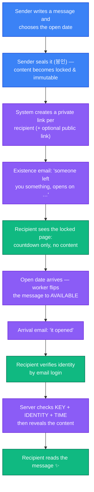
```mermaid
flowchart TD
    classDef sender fill:#3B82F6,color:#fff,stroke:#1D4ED8,stroke-width:1.5px
    classDef system fill:#8B5CF6,color:#fff,stroke:#6D28D9,stroke-width:1.5px
    classDef recipient fill:#10B981,color:#fff,stroke:#047857,stroke-width:1.5px

    A["Sender writes a message and<br/>chooses the open date"]:::sender
    B["Sender seals it (봉인) —<br/>content becomes locked & immutable"]:::sender
    C["System creates a private link per<br/>recipient (+ optional public link)"]:::system
    D["Existence email: 'someone left<br/>you something, opens on …'"]:::system
    E["Recipient sees the locked page:<br/>countdown only, no content"]:::recipient
    F["Open date arrives — worker flips<br/>the message to AVAILABLE"]:::system
    G["Arrival email: 'it opened'"]:::system
    H["Recipient verifies identity<br/>by email login"]:::recipient
    I["Server checks KEY + IDENTITY + TIME<br/>then reveals the content"]:::system
    J["Recipient reads the message ✨"]:::recipient

    A --> B --> C --> D --> E
    E --> F --> G --> H --> I --> J
```

Everything in Section 3 is a screen somewhere on this line; everything in Section 4 is the machinery between the boxes.

---

## 3. The portals, one by one

### 3.1 Landing page — the promise & the viral hook

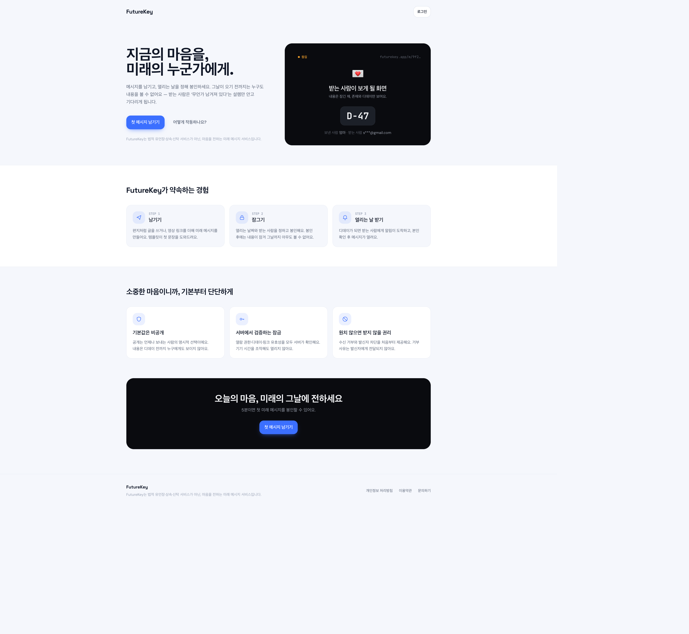

The first thing a visitor sees is the promise — **"지금의 마음을, 미래의 누군가에게"** (*Today's heart, to someone in the future*) — paired with a live preview of **the exact screen a recipient will get**: a dark "vault" card showing a **D-47** countdown with the content hidden. The page then tells the three-step story — **남기기 / 잠그기 / 열리는 날 받기** (*Leave / Lock / Receive on the open day*) — and a trust band (**기본값은 비공개** *private by default*; **서버에서 검증하는 잠금** *server-verified lock*; **원치 않으면 받지 않을 권리** *the right to refuse*). The legal-positioning disclaimer ("not a will/inheritance/trust service") anchors the footer.

> **Why it matters:** the hero leads with the recipient's experience, not a feature list — because the recipient's delight is what converts onlookers into senders.

### 3.2 Sign in — passwordless by design

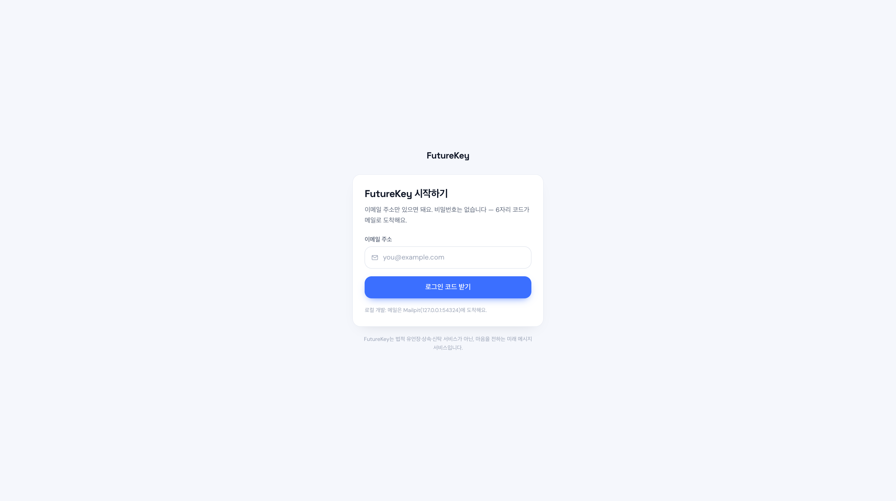

There is **no password**. The sender enters an email and receives a 6-digit code — **로그인 코드 받기** (*Get login code*). This removes the single biggest source of signup friction and account-recovery cost, and it doubles as the mechanism that later proves a recipient really owns the address a message was left for (Section 4.2). Social sign-in (Google/Kakao/Apple) is wired in configuration but intentionally not surfaced in the UI yet — the launch build is passwordless email only, which is why the card shows just the email field.

### 3.3 Verify — check your mail

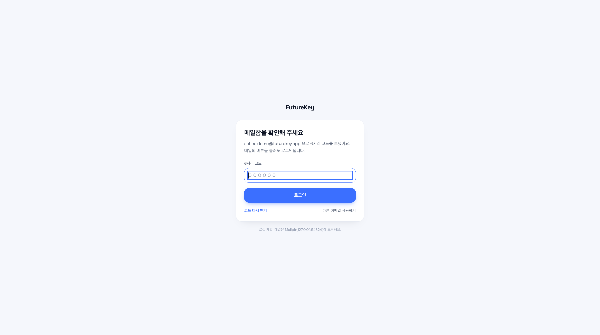

After requesting a code the sender lands on **메일함을 확인해 주세요** (*Please check your mailbox*) and enters the six digits. The same screen serves recipients on the open day, which is why the friction here is deliberately tiny.

### 3.4 Onboarding — three ideas, one live sample

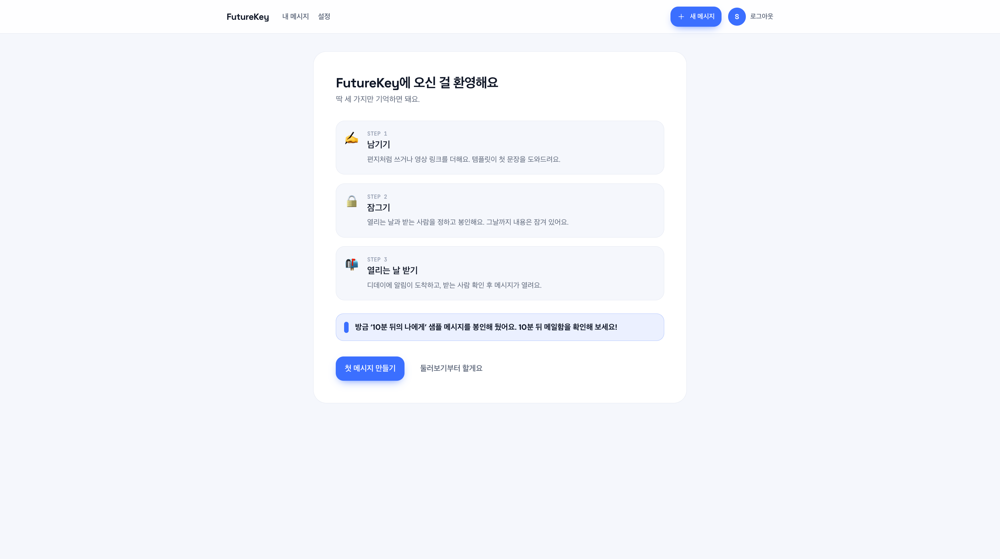

On first sign-in the product teaches the whole model in three cards — **남기기 / 잠그기 / 열리는 날 받기** — and quietly seals a **"10분 뒤의 나에게"** (*To me, 10 minutes from now*) sample on the new user's behalf. Ten minutes later that sample opens and sends a real arrival email, so a brand-new user **experiences the entire loop end-to-end within their first session** without composing anything.

### 3.5 Dashboard — everything I've left

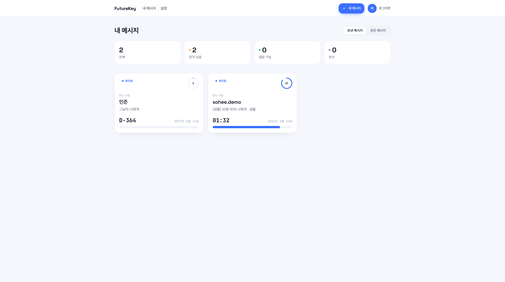

**내 메시지** (*My messages*) is the home base. A status strip summarizes the portfolio — **전체 / 잠겨 있음 / 열람 가능 / 초안** (*Total / Locked / Available / Draft*) — and each message is a card with a live countdown, the recipient, and the open date. A **보낸 메시지 / 받은 메시지** (*Sent / Received*) toggle separates messages you've left from messages left *for you*.

### 3.6 Compose — a five-step wizard

Composing is a guided wizard — **템플릿 → 내용 → 받는 사람 → 예약 → 확인** (*Template → Content → Recipients → Schedule → Review*) — with a debounced **초안 저장됨** (*Draft saved*) autosave so nothing is ever lost.

**Step 1 · Template** — *어떤 마음을 남길까요?* (What do you want to leave?)

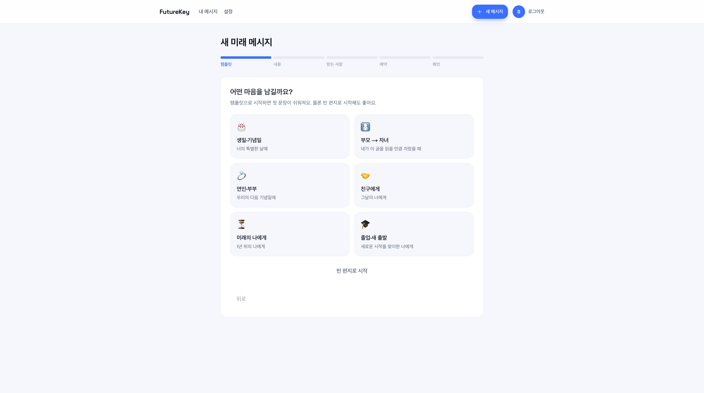

Six emotional starting points (birthday, parent→child, couple, friend, future-self, graduation) plus a blank letter. A template removes the blank-page problem by pre-filling a first line.

**Step 2 · Content** — *마음을 적어주세요* (Write your heart)

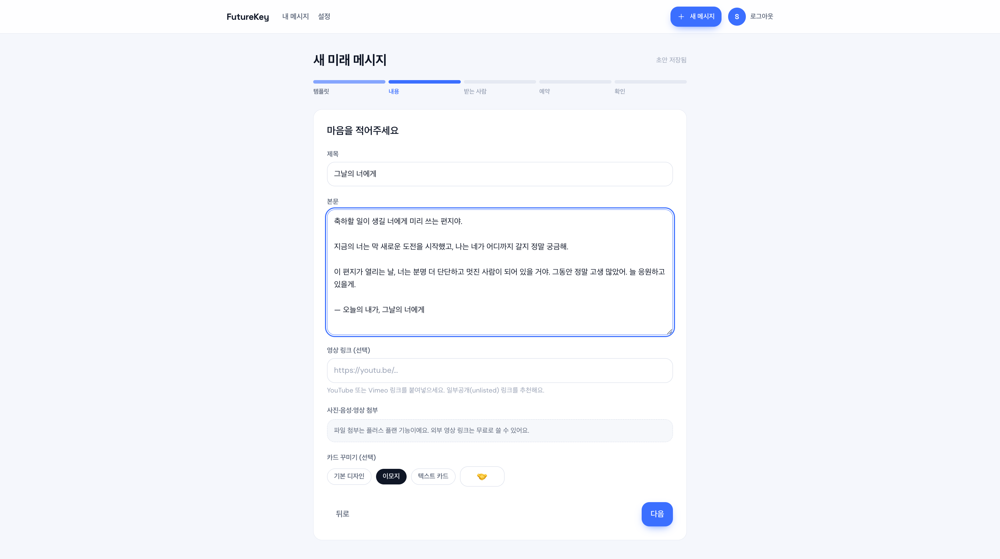

Title and body, an optional **영상 링크** (*video link*, YouTube/Vimeo, validated), and card styling. File attachments (photo/audio/video) are flagged as a **플러스 플랜** (*Plus plan*) feature — the first paid touchpoint inside the flow.

**Step 3 · Recipients** — *누구에게 보낼까요?* (Who is it for?)

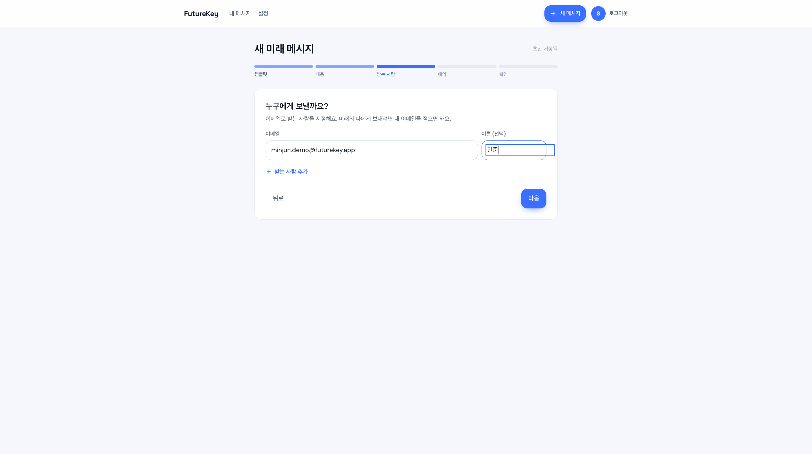

Recipients are specified by email (your own email if it's a note to your future self). The plan's recipient limit is enforced here.

**Step 4 · Schedule** — *언제 열릴까요?* (When does it open?)

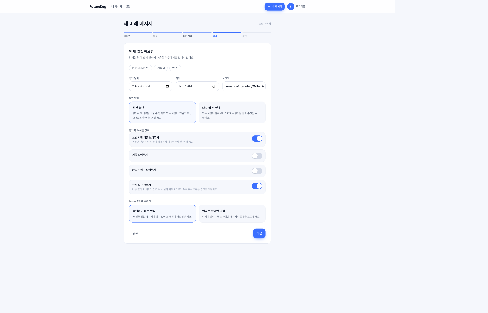

This is the heart of the product, and the richest screen:

- **Open date/time + timezone** — stored in the sender's timezone, displayed in each viewer's local time. Quick presets: **10분 뒤 / 1개월 뒤 / 1년 뒤**.
- **봉인 방식** (*Seal method*) — **완전 봉인** (*Full seal*, immutable: "the recipient can trust it's your true words from that day") vs **다시 열 수 있게** (*Re-openable*: editable until the recipient opens it).
- **공개 전 보여줄 정보** (*What to reveal before opening*) — granular toggles for sender name, title, card art, and **존재 링크 만들기** (*Create an existence link* — the public viral page). **Everything defaults to private; disclosure is always the sender's explicit choice.**
- **받는 사람에게 알리기** (*Notify the recipient*) — **봉인하면 바로 알림** (*notify on seal*) or **열리는 날에만 알림** (*only on the open day* — so the recipient doesn't even know the message exists until it opens).

**Step 5 · Review** — *이대로 봉인할까요?* (Seal it like this?)

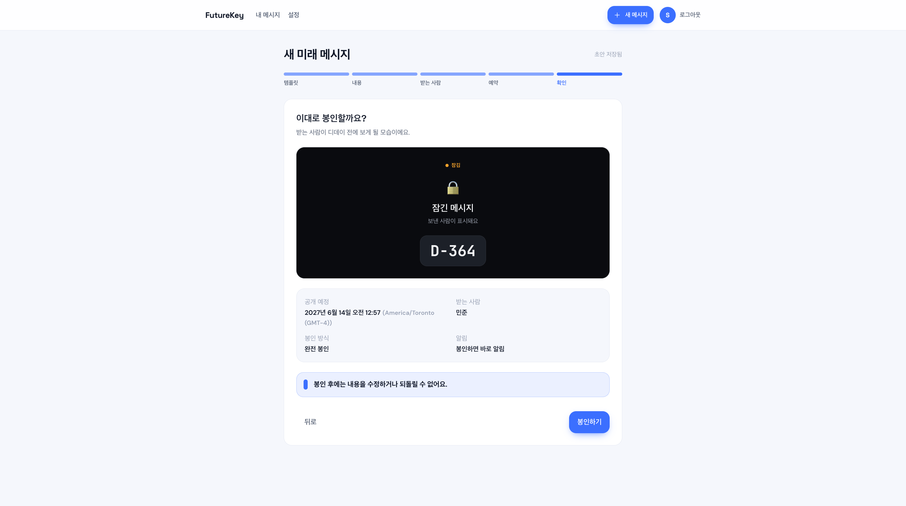

The sender sees **exactly the locked card the recipient will get**, a summary of the schedule/policy/notification, and a clear warning that a full seal cannot be undone. The **봉인하기** (*Seal*) button is the emotional climax: a draft becomes a promise.

### 3.7 Seal confirmation — the promise, and the links

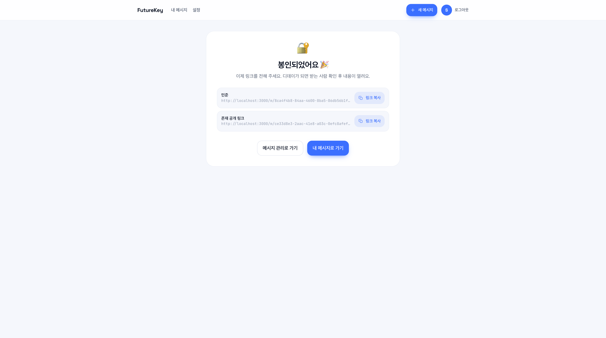

**봉인되었어요 🎉** (*It's sealed*). The product hands back a **copyable private link per recipient** and, if enabled, a separate **존재 공개 링크** (*public existence link*). From here the sender can manage the message or return to the dashboard.

### 3.8 Message management — control after sealing

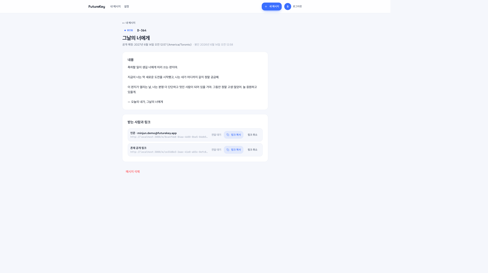

Each message has a management page showing its status (**봉인됨**, **D-364**), the open date, the content, and a **받는 사람과 링크** (*Recipients & links*) table. Per link the sender can **링크 복사** (*Copy*) or **링크 취소** (*Revoke*); the message itself can be deleted, and (for re-openable seals) un-sealed. Crucially, link states shown to the sender — **전달 대기 / 잠금 화면 확인함 / 열람함 / 전달 불가** (*Pending / Saw the locked screen / Read / Undeliverable*) — **never reveal an opt-out**: a recipient who declined looks the same as one who simply hasn't opened yet.

### 3.9 Settings — profile, plan, and data rights

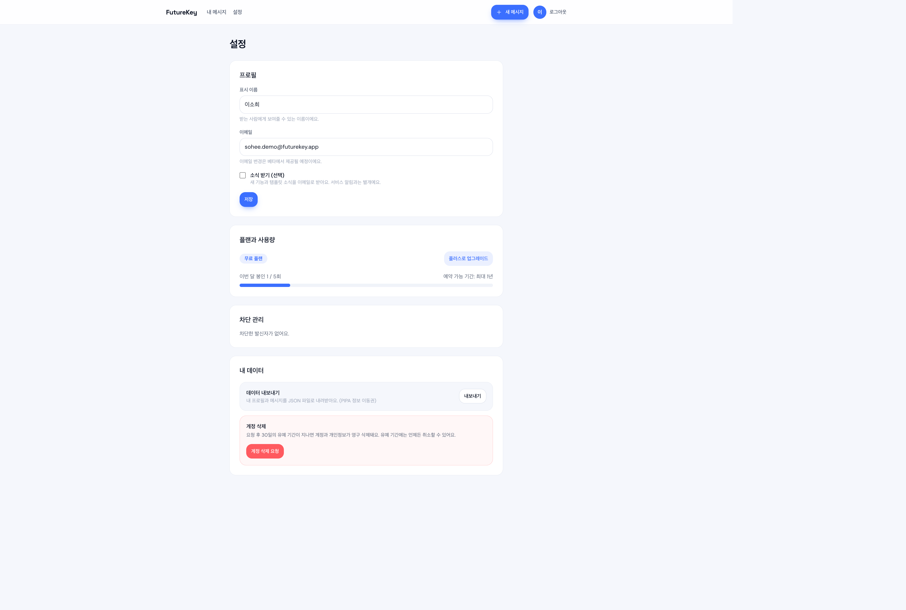

Four things live here. **프로필** (*Profile*) — display name (shown to recipients) and a view-only email. **플랜과 사용량** (*Plan & usage*) — the **무료 플랜** (*Free plan*) card with this month's seal count (e.g. *1 / 5*), the booking horizon (*up to 1 year*), and **플러스로 업그레이드** (*Upgrade to Plus*). **차단 관리** (*Block management*) — lists any senders the user has blocked (here, none), reinforcing the recipient-control story. **내 데이터** (*My data*) — JSON **데이터 내보내기** (*export*) and a 30-day-grace **계정 삭제** (*account deletion*), both fulfilling Korean privacy-law (PIPA) rights. This is where the free→paid conversation happens and where the platform earns trust through user control.

### 3.10 The locked page — what the recipient sees first

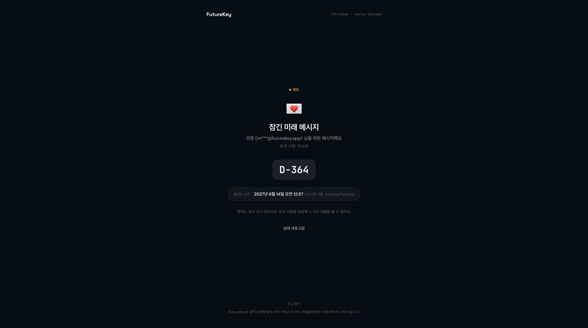

This is the product's highest-stakes first impression. A recipient who has never heard of FutureKey arrives at a calm, dark **잠긴 미래 메시지** (*Locked future message*) page that leads with warmth: *a message for **민준** (m\*\*\*@…)*, *from **이소희***, and a countdown shown as a big **D-364** badge with the exact open time — **열리는 시각** (*Opens at*) **2027년 6월 14일 오전 12:57** — rendered in the viewer's own local time (here, America/Toronto). The line **"열리는 날이 오기 전까지는 보낸 사람을 포함해 누구도 내용을 볼 수 없어요"** (*until it opens, no one — including the sender — can see the content*) is the trust promise, stated plainly. The recipient's email is **masked**; what's disclosed is exactly what the sender chose.

It works just as well on a phone — the channel where most shared links are actually opened:

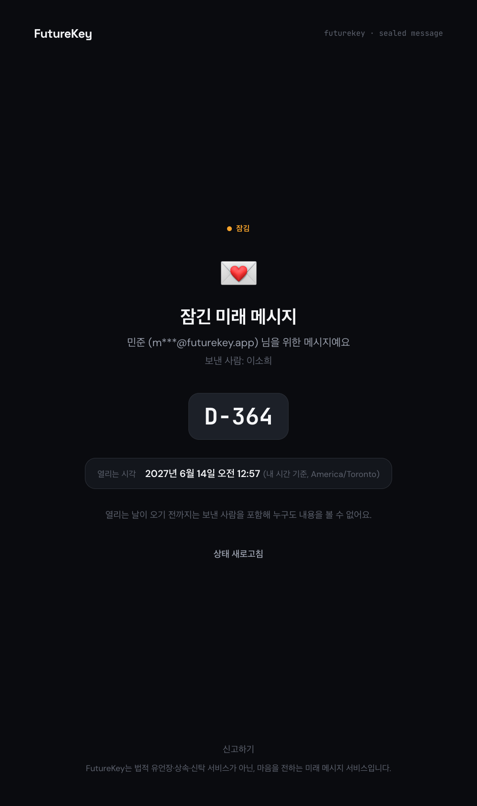

### 3.11 The public existence page — the viral surface

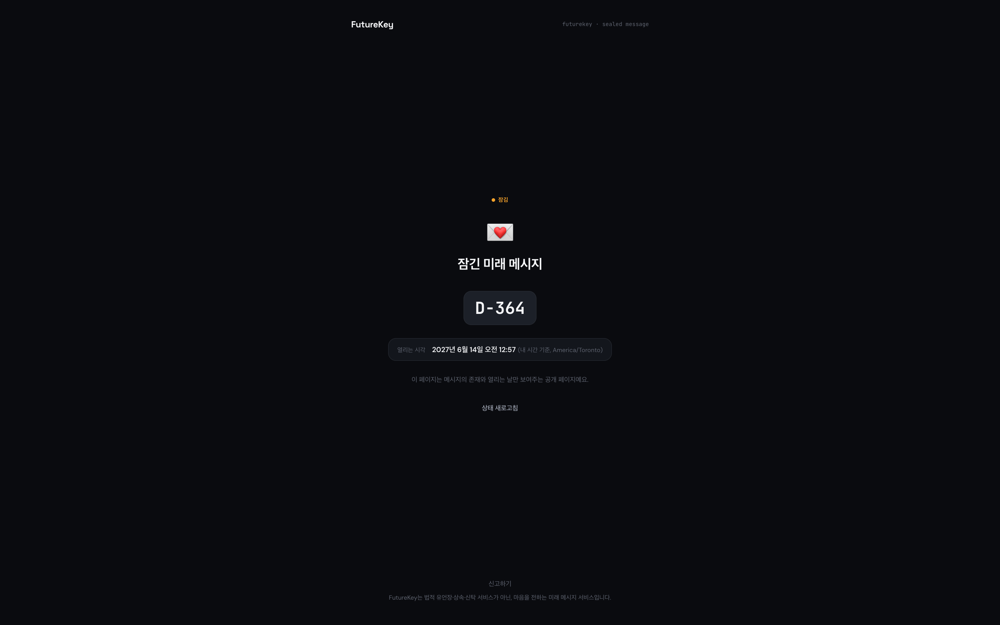

The public link is the same vault aesthetic with **all identity stripped away** — only that a message exists and its countdown. The page says so outright: **이 페이지는 메시지의 존재와 열리는 날만 보여주는 공개 페이지예요** (*this public page shows only that a message exists and the day it opens*). No recipient, no sender, no content — by design (a strict business rule). Its job is pure growth: a stranger who sees a countdown for someone else's message is a candidate to create one of their own.

### 3.12 Release day — the arrival gate, then the reveal

When the open date passes, opening the recipient's link no longer shows a countdown — it shows that **the message has opened**, and asks the recipient to prove who they are first.

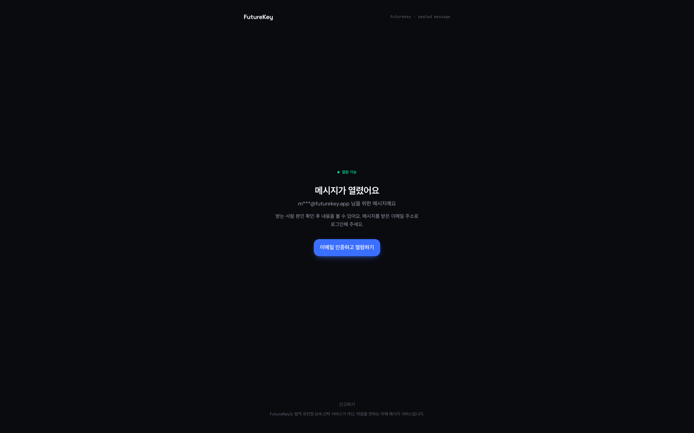

**메시지가 열렸어요** (*The message has opened*) — *"verify with the email this was sent to, then read it."* One identity check stands between anticipation and payoff. After the recipient logs in with that email, the content resolves with a quiet, ceremonial reveal:

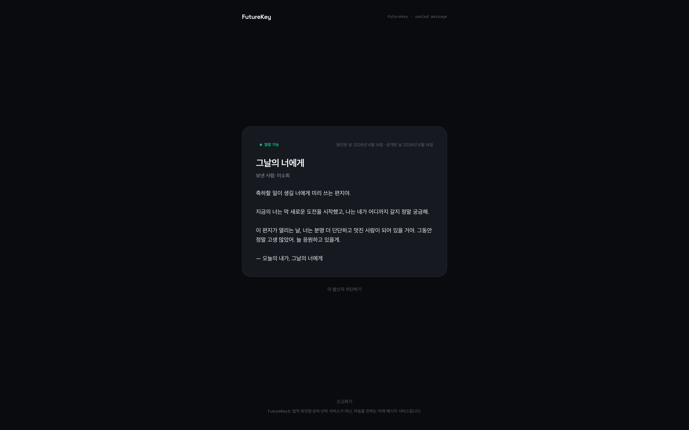

The **열람 가능** (*Available*) state shows the sealed and opened dates, the title, **보낸 사람: 이소희** (*From: Sohee Lee*), and the full letter — rendered only for this one authorized request. This single moment is what makes FutureKey feel different from a scheduled email, and it's the primary word-of-mouth trigger. The recipient also gets first-class controls: **이 발신자 차단하기** (*Block this sender*) and **신고하기** (*Report*).

### 3.13 The right to refuse — one-click opt-out

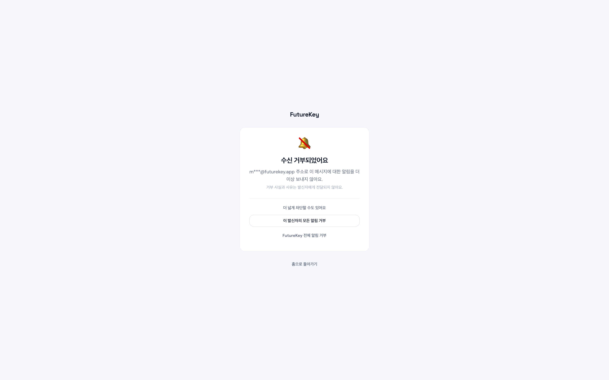

Every notification carries a signed, one-click **수신 거부** (*opt-out*) link. The recipient can decline **this message**, escalate to **all from this sender**, or **all of FutureKey** — and the page states the trust guarantee outright: **"거부 사실과 사유는 발신자에게 전달되지 않아요"** (*the opt-out and its reason are never disclosed to the sender*). Refusal is a first-class right, built in from the start rather than buried.

### 3.14 Notifications — the emails the system sends

Email is how FutureKey reaches people who don't have the app open. Locally, every message the system sends is captured by **Mailpit** — a local test inbox that holds outgoing mail so the team can verify each email without ever sending to a real person. Filtered to one recipient, you can see the complete arc — existence (💌) → arrival (🔓) → login code:

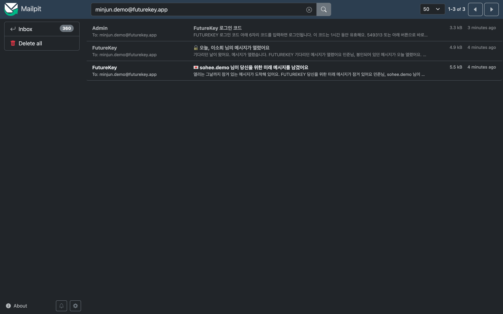

And here is the **arrival email** itself, **기다리던 메시지가 열렸어요** (*The message you've been waiting for has opened*), with the sender's name, a **지금 열어보기** (*Open now*) button, and a **수신 거부** (*opt-out*) link in the footer:

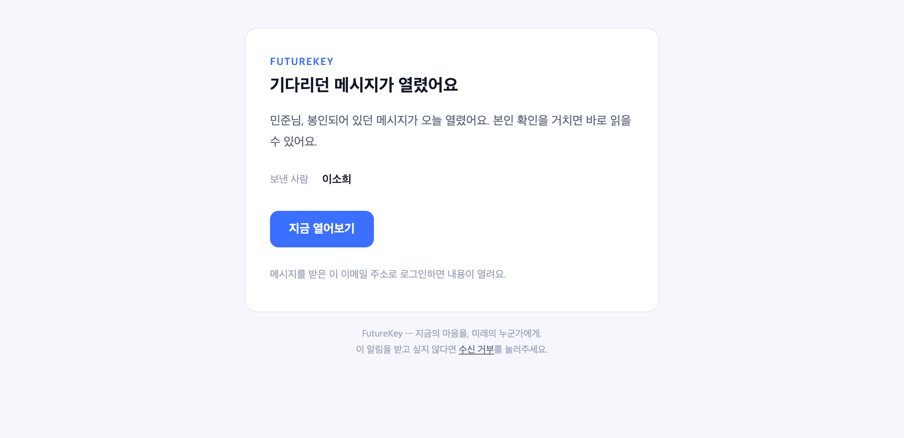

Templates only ever carry **disclosure-approved fields** — never the message content. In production, a one-line configuration switch points the same code at a real email provider (Resend) instead of the local test inbox; nothing else changes.

---

## 4. How the promise is enforced

The screens above are the surface. The promise — *content stays locked until the chosen moment, then opens only for the chosen person* — is enforced by five flows in the database, not in the browser. (Decisions of record: PRD KEY-003, TRD §3, HLD §10.)

### 4.1 Sealing a message

When the sender hits **봉인하기**, a single database function does all the work in one transaction — validating the plan limits, freezing the content, and minting the links and notifications.

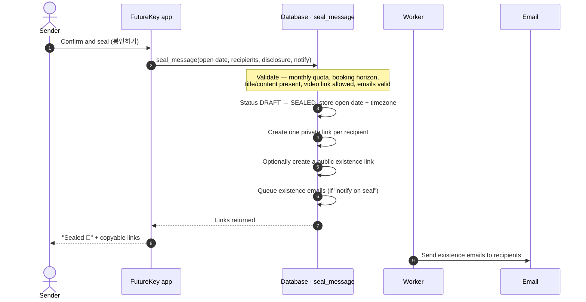
```mermaid
sequenceDiagram
    autonumber
    actor Sender
    participant App as FutureKey app
    participant DB as Database · seal_message
    participant Worker
    participant Email

    Sender->>App: Confirm and seal (봉인하기)
    App->>DB: seal_message(open date, recipients, disclosure, notify)
    Note over DB: Validate — monthly quota, booking horizon,<br/>title/content present, video link allowed, emails valid
    DB->>DB: Status DRAFT → SEALED, store open date + timezone
    DB->>DB: Create one private link per recipient
    DB->>DB: Optionally create a public existence link
    DB->>DB: Queue existence emails (if "notify on seal")
    DB-->>App: Links returned
    App-->>Sender: "Sealed 🎉" + copyable links
    Worker->>Email: Send existence emails to recipients
```

If any rule fails — over the monthly seal limit, past the plan's booking horizon, no content — the whole thing rolls back and the sender sees a friendly message. Nothing is half-sealed.

### 4.2 Revealing — the triple gate (KEY-003)

This is the single most important guarantee. Whether a message may be read is decided by **one server-side function that checks three things together**, and it is recomputed from the server clock on every read — so a recipient cannot unlock anything early by changing their device's date.

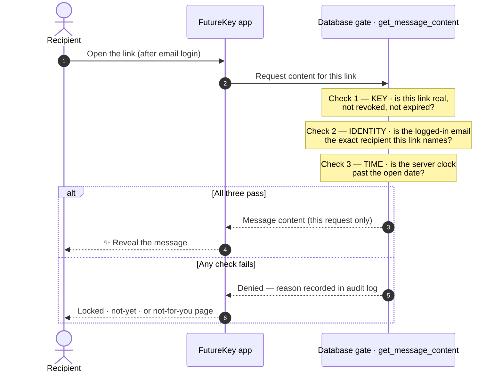
```mermaid
sequenceDiagram
    autonumber
    actor Recipient
    participant App as FutureKey app
    participant Gate as Database gate · get_message_content

    Recipient->>App: Open the link (after email login)
    App->>Gate: Request content for this link
    Note over Gate: Check 1 — KEY · is this link real,<br/>not revoked, not expired?
    Note over Gate: Check 2 — IDENTITY · is the logged-in email<br/>the exact recipient this link names?
    Note over Gate: Check 3 — TIME · is the server clock<br/>past the open date?
    alt All three pass
        Gate-->>App: Message content (this request only)
        App-->>Recipient: ✨ Reveal the message
    else Any check fails
        Gate-->>App: Denied — reason recorded in audit log
        App-->>Recipient: Locked · not-yet · or not-for-you page
    end
```

Every denial — a stranger with the link, the right person too early, a revoked link — is **logged**, and content is fetched server-side for exactly one authorized request. The browser never holds locked content.

### 4.3 The notification lifecycle

A background worker drives the open-day transition and all email, with retries and suppression built in. Importantly, **availability is computed from time at read** (Section 4.2) — the worker only drives *notifications and lifecycle*, so even a stalled worker can never block a legitimate unlock.

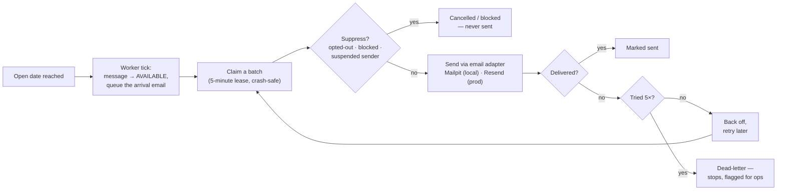
```mermaid
flowchart LR
    A["Open date reached"] --> B["Worker tick:<br/>message → AVAILABLE,<br/>queue the arrival email"]
    B --> C["Claim a batch<br/>(5-minute lease, crash-safe)"]
    C --> D{"Suppress?<br/>opted-out · blocked ·<br/>suspended sender"}
    D -- yes --> E["Cancelled / blocked<br/>— never sent"]
    D -- no --> F["Send via email adapter<br/>Mailpit (local) · Resend (prod)"]
    F --> G{"Delivered?"}
    G -- yes --> H["Marked sent"]
    G -- no --> I{"Tried 5×?"}
    I -- no --> J["Back off,<br/>retry later"]
    J --> C
    I -- yes --> K["Dead-letter —<br/>stops, flagged for ops"]
```

This is what lets the business promise reliable delivery: transient failures retry with backoff, permanent failures are set aside for a human to handle (a "dead-letter") instead of silently vanishing, and opt-outs/blocks are honoured at the last moment before send.

### 4.4 A message's life — the states

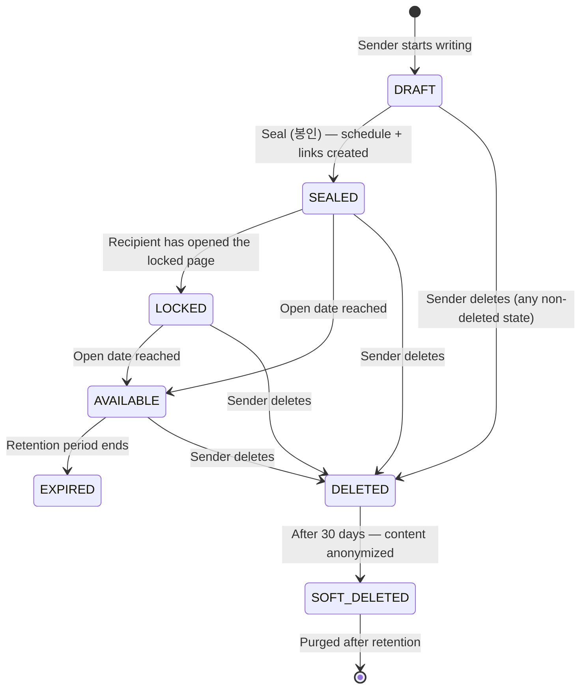
```mermaid
stateDiagram-v2
    [*] --> DRAFT: Sender starts writing
    DRAFT --> SEALED: Seal (봉인) — schedule + links created
    SEALED --> LOCKED: Recipient has opened the locked page
    SEALED --> AVAILABLE: Open date reached
    LOCKED --> AVAILABLE: Open date reached
    AVAILABLE --> EXPIRED: Retention period ends
    DRAFT --> DELETED: Sender deletes (any non-deleted state)
    SEALED --> DELETED: Sender deletes
    LOCKED --> DELETED: Sender deletes
    AVAILABLE --> DELETED: Sender deletes
    DELETED --> SOFT_DELETED: After 30 days — content anonymized
    SOFT_DELETED --> [*]: Purged after retention
```

`DRAFT` is private to the sender; `SEALED` is the promise made; `LOCKED` means a recipient has seen the waiting page (after which a full seal can no longer be un-done); `AVAILABLE` is open; `EXPIRED`/`SOFT_DELETED` cover retention and deletion with privacy-preserving anonymization. A sender can delete a message from any state that isn't already deleted.

### 4.5 Why it's trustworthy — the architecture in one picture

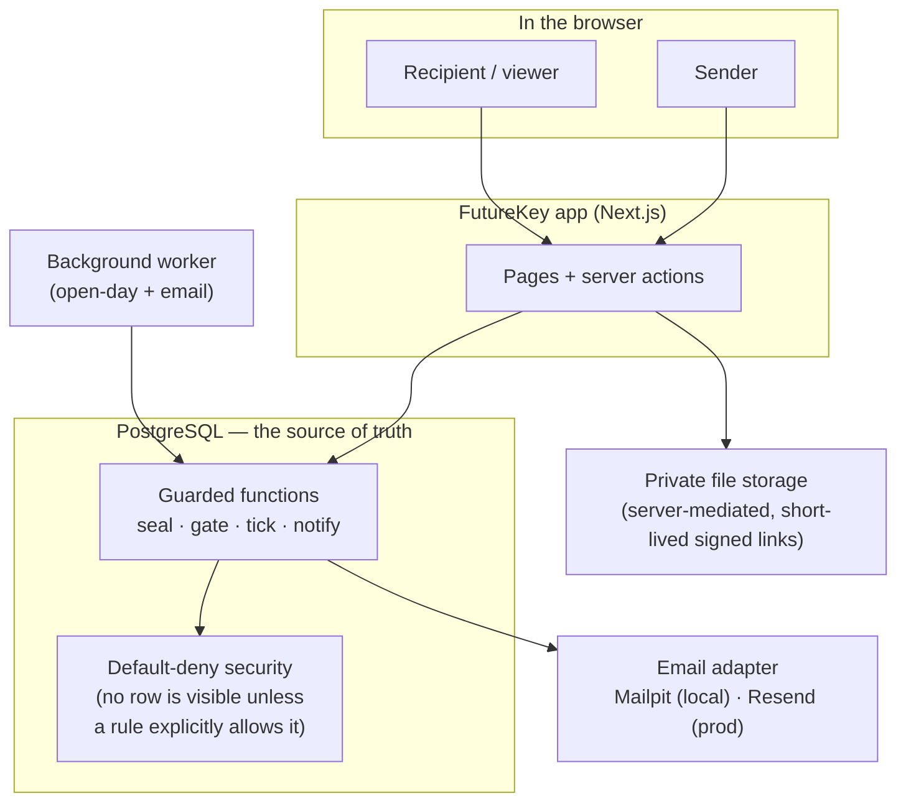
```mermaid
flowchart TB
    subgraph Client["In the browser"]
      B1["Sender"]
      B2["Recipient / viewer"]
    end
    subgraph App["FutureKey app (Next.js)"]
      P["Pages + server actions"]
    end
    subgraph Data["PostgreSQL — the source of truth"]
      RLS["Default-deny security<br/>(no row is visible unless<br/>a rule explicitly allows it)"]
      RPC["Guarded functions<br/>seal · gate · tick · notify"]
    end
    W["Background worker<br/>(open-day + email)"]
    E["Email adapter<br/>Mailpit (local) · Resend (prod)"]
    S["Private file storage<br/>(server-mediated, short-lived signed links)"]

    B1 --> P
    B2 --> P
    P --> RPC
    RPC --> RLS
    W --> RPC
    RPC --> E
    P --> S
```

The point a non-technical stakeholder should take away: **all access control lives in the database, not in the app or the browser.** Even if someone bypassed the user interface entirely, the database refuses to hand back a locked message. That's what makes "no one sees it until the day" a guarantee rather than a hope.

---

## 5. Where the business model shows up

The free/paid structure is already wired into the screens above — the levers are live even though charging is not yet switched on:

| Lever | In the product today | Plan difference |
|---|---|---|
| **Monthly seal limit** (the core conversion mechanic) | Settings shows *"이번 달 봉인 N / 5회"*; the wizard blocks once the limit is hit | Free **5/month** → Plus **60/month** |
| **Booking horizon** | Schedule step enforces it; Settings states *"예약 가능 기간: 최대 1년"* | Free **1 year** → Plus **10 years** |
| **Recipients per message** | Enforced in the Recipients step | Free **5** → Plus **20** |
| **In-platform media** (photo/audio/video) | Compose step marks attachments as a Plus feature | Plus only — **50 MB × 5** |
| **Export / download** | Settings → *데이터 내보내기* | Free has JSON export; richer content export is a Plus trust feature |

Beyond individual subscriptions, the BRD frames longer-term revenue — B2B brand moments and coupons delivered at the emotional peak of an opening, physical delivery (e.g. branded USB), a Family Vault, and couple/anniversary packages. The public existence page (3.11) is the unpaid growth engine that feeds all of it.

> **Caveat:** the specific limit numbers are experiment defaults in a config table, **not** validated pricing. The BRD's own plan is to confirm them from real user behaviour.

---

## 6. What's proven vs. what's ahead

This walkthrough shows a **complete, working MVP running locally** — the full loop *leave → seal → lock → open-day → arrival email → identity check → reveal* is built and proven by 67 automated tests, including a browser-driven golden path with real email round-trips (see [recap.md](../recap.md)).

**Deliberately left for the go-to-market step:**

- Production deployment + a real email provider with proper domain authentication and a Korean-deliverability proof.
- Google/Kakao/Apple sign-in (wired in configuration but not yet surfaced in the UI — it stays hidden until real credentials exist).
- Billing (plan gating is live; **charging is not** — "upgrade" currently routes to a beta enquiry).
- Column-level encryption review, archival, analytics/monitoring wiring, and a load test.

**Honest caveats:** the plan limits are experiment defaults, not validated pricing; the legal pages are beta drafts pending counsel review; and deliverability beyond the local mail sink is unproven until a sending domain exists.

---

## Appendix · Korean label glossary

| Korean | Gloss | Where it appears |
|---|---|---|
| 지금의 마음을, 미래의 누군가에게 | Today's heart, to someone in the future | Landing tagline |
| 첫 메시지 남기기 | Leave your first message | Landing / onboarding CTA |
| 로그인 코드 받기 | Get login code | Sign in |
| 메일함을 확인해 주세요 | Please check your mailbox | Verify |
| 내 메시지 | My messages | Dashboard |
| 보낸 / 받은 메시지 | Sent / Received messages | Dashboard tabs |
| 전체 · 잠겨 있음 · 열람 가능 · 초안 | Total · Locked · Available · Draft | Dashboard stats |
| 새 메시지 | New message | Compose entry |
| 템플릿 · 내용 · 받는 사람 · 예약 · 확인 | Template · Content · Recipients · Schedule · Review | Wizard steps |
| 초안 저장됨 | Draft saved | Wizard autosave |
| 봉인 방식 · 완전 봉인 · 다시 열 수 있게 | Seal method · Full seal (immutable) · Re-openable | Schedule step |
| 공개 전 보여줄 정보 | What to reveal before opening | Schedule step |
| 존재 링크 만들기 | Create an existence (public) link | Schedule step |
| 봉인하기 | Seal | Review step |
| 봉인되었어요 | It's sealed | Seal confirmation |
| 잠긴 미래 메시지 | Locked future message | Locked page |
| D-NNN | Days remaining until it opens | Countdown badge (locked / existence pages) |
| 열리는 시각 | Opens at | Locked / existence pages |
| 메시지가 열렸어요 | The message has opened | Arrival gate |
| 열람 가능 | Available (readable) | Reveal |
| 보낸 사람 | From (sender) | Locked page / reveal |
| 이 발신자 차단하기 · 신고하기 | Block this sender · Report | Reveal footer |
| 수신 거부 | Opt out of notifications | Emails / opt-out page |
| 설정 · 프로필 · 플랜과 사용량 · 내 데이터 | Settings · Profile · Plan & usage · My data | Settings |
| 무료 플랜 · 플러스로 업그레이드 | Free plan · Upgrade to Plus | Settings |
| 데이터 내보내기 · 계정 삭제 | Export data · Delete account | Settings |

---

*Every screenshot in this document was captured from the running application on 2026-06-14. Diagrams render in the docs portal; on GitHub they appear as code where Mermaid isn't supported.*
